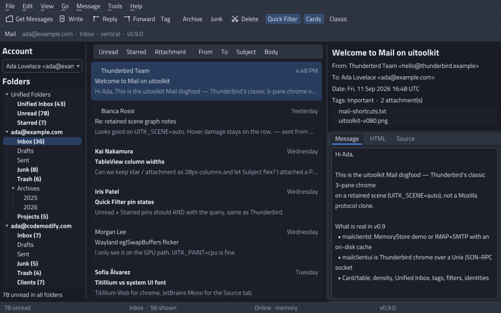
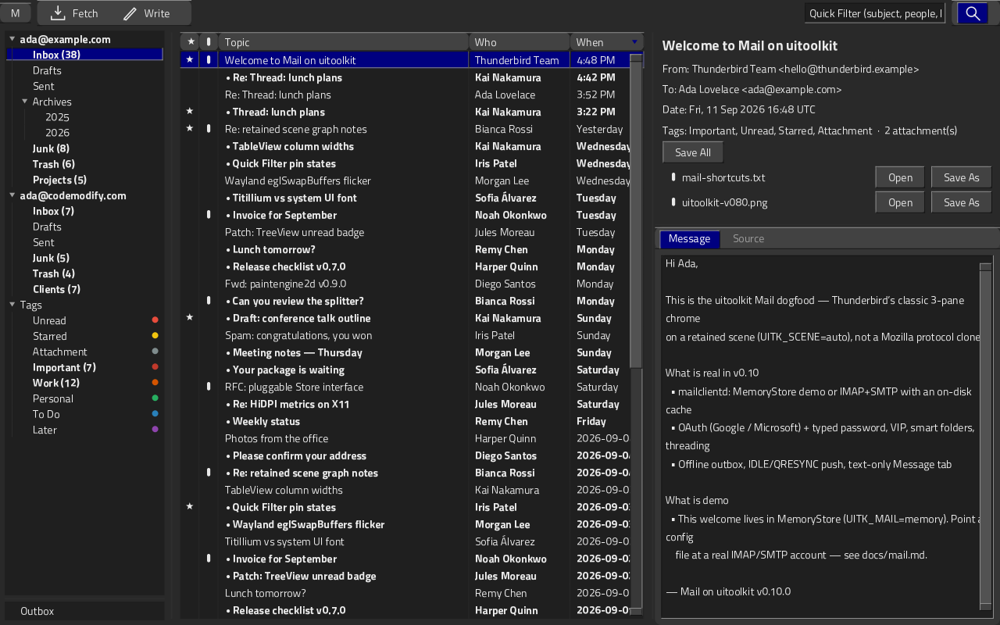
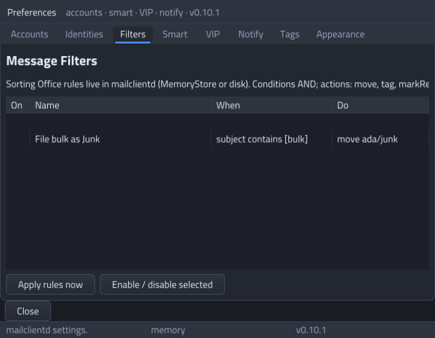
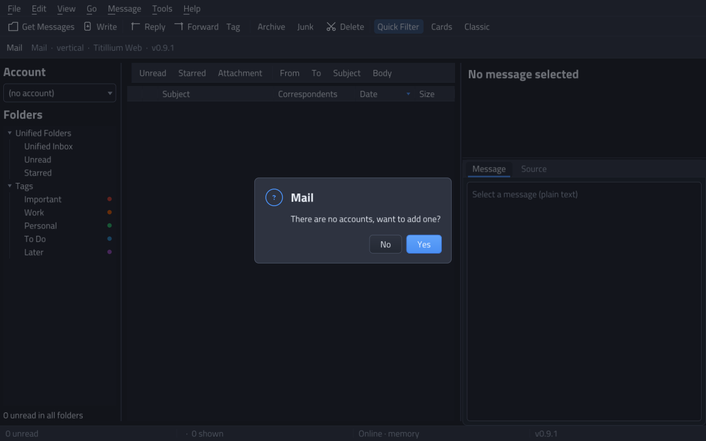
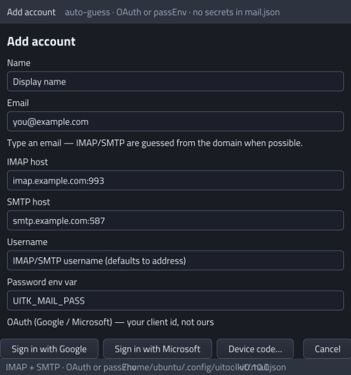
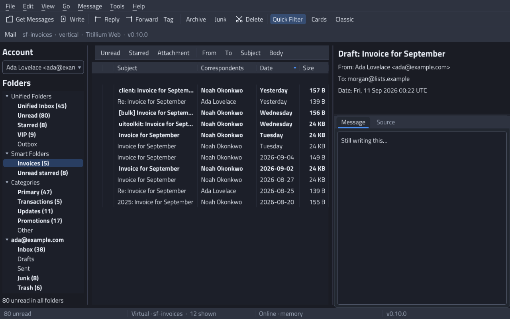

# uitoolkit

**Pure-Go desktop UI toolkit.** Retained widget tree, layout, themes, and
X11 and Wayland window backends. Every pixel is painted with
[`github.com/codemodify/paintengine2d`](https://github.com/codemodify/paintengine2d)
(v0.9.0+). Default UI is **Titillium Web**; mono / code is **JetBrains Mono**
(OFL, embedded). Outlines are rasterized through paintengine2d into a white
atlas and tinted with `Paint.Color`. There is no second rasterizer, no Skia,
no Gio renderer, and no Electron.

```go
app := uitoolkit.New(uitoolkit.Options{Look: uitoolkit.DarkLook()})
win, _ := app.NewWindow(uitoolkit.WindowOptions{Title: "Hello", Width: 800, Height: 560})
win.SetContent(uitoolkit.NewColumn(
    uitoolkit.NewTitle("Hello"),
    uitoolkit.NewButton("OK", func() { app.Quit() }),
))
_ = app.Run()
```

```bash
go get github.com/codemodify/uitoolkit@dev
go get github.com/codemodify/paintengine2d@v0.9.0
# if v0.9.0 is not on GitHub yet (local engine checkout):
# go mod edit -replace=github.com/codemodify/paintengine2d=/path/to/paintengine2d
```

| | |
| --- | --- |
| Language | Go 1.22+ |
| Paint | paintengine2d **v0.9.0** (`Scene` / `Recorder` / GPU rect batches; flatten cache) |
| Fonts | Titillium Web (UI) + JetBrains Mono (code), OpenType → atlas |
| Windowing | Linux X11 + Wayland (`wl_egl_window` / eglSwapBuffers, else `wl_shm` / `XPutImage`); offscreen always |
| CGO | optional — tests and screenshots are `CGO_ENABLED=0` |
| License | MIT |

## Screenshots

Real frames from the gallery, Notes, Inspector, Files, and Mail, painted through
paintengine2d with Titillium Web (and JetBrains Mono in code views).

### Widget gallery — dark


### Widget gallery — light


### Themed controls


### Scrollable content


### Dialog overlay


### MenuBar drop-down


### TreeView


### ToolBar


### ComboBox drop-down


### MessageBox


### TableView


### File picker stub


### Tooltip


### TextArea


### Accordion / Switch


### Notes — a small desktop app


### Inspector — preferences sample


### Files — projects dogfood


### Mail — Thunderbird 3-pane (dark)


### Mail — light LookAndFeel


### Mail — classic layout (preview below)


### Mail — compose window


### Mail — preferences (accounts stub)


### Mail — card view



### Mail — compact density



### Mail — message filters



### Mail — first-run (no accounts)



### Mail — Add Account (IMAP/POP3 + Test connection)



### Mail — Smart folder (Invoices)



### Font roles — Titillium Web + JetBrains Mono


LookAndFeel locks **UI → Titillium Web** and **Mono → JetBrains Mono**
(OFL, embedded). mononoki is not the default mono face.

Name-by-name map vs Qt / GTK / Avalonia / Fyne / WinForms / WPF / Apple:
[Widget comparison](#widget-comparison) · [docs/widgets.md](docs/widgets.md).

Regenerate:

```bash
go run ./examples/gallery -screenshot docs/screenshots
go run ./examples/mail -screenshot docs/screenshots
```

## Quickstart

```bash
git clone https://github.com/codemodify/uitoolkit.git
cd uitoolkit
CGO_ENABLED=0 go test ./...
go run ./cmd/uitest-driver -short    # headless gallery + fake Mail
go run ./examples/gallery            # Wayland if WAYLAND_DISPLAY, else X11
UITK_BACKEND=x11 go run ./examples/gallery
UITK_BACKEND=wayland go run ./examples/gallery
UITK_PAINT=auto go run ./examples/gallery   # default: GPU if EGL works
UITK_PAINT=cpu go run ./examples/gallery    # v0.4.1 CPU present
UITK_SCENE=off go run ./examples/gallery    # v0.5 immediate paint (no scene graph)
go run ./examples/gallery -headless  # writes gallery.png
go run ./examples/notes
go run ./examples/inspector
go run ./examples/files
go run ./examples/files -headless   # writes files.png
go run ./cmd/mailclientd            # Unix socket JSON-RPC daemon
UITK_SCENE=auto go run ./cmd/mailclientui
go run ./examples/mail              # in-process daemon + UI (same protocol)
go run ./examples/mail -headless    # writes mail.png
go run ./examples/mail -classic     # preview below the thread list
go run ./examples/mail -light
```

## Testing

See **[docs/testing.md](docs/testing.md)** for how to run the suite, what
the app driver covers, and the **Mail safety** rule (never point tests at
a live IMAP account or `mail.json`).

```bash
CGO_ENABLED=0 go test ./...
go run ./cmd/uitest-driver           # gallery + in-memory Mail
CGO_ENABLED=1 go build ./cmd/mailclientui   # Linux CGO / Wayland
```

When you fix a UI bug, add a regression test. Headless / CI paints into
`paintengine2d.NewImage` and can `Window.WritePNG`.
`UITK_PAINT=auto` (default) tries paintengine2d **GPUDevice** (Linux EGL/GLES2)
and falls back to CPU. On Linux with CGO a GPU window presents with
**eglSwapBuffers** (`wl_egl_window` on Wayland, EGL window on X11). If EGL
fails, present is the v0.4.1 CPU path: **XPutImage** on X11, **wl_shm
XRGB8888** on Wayland (`UITK_WAYLAND_PRESENT=auto|shm`).
`UITK_WAYLAND_PRESENT=dmabuf` opts into linux-dmabuf on the CPU path.
`UITK_PAINT=cpu` forces the CPU painter. If a Wayland window is fully
transparent, set `UITK_PAINT=cpu` and/or `UITK_WAYLAND_PRESENT=shm`.
`Application.Run` waits on the display fd (not a 16 ms ticker) and skips
`Present` when damage is empty. Default `UITK_SCENE` records a retained
graph (`Recorder` / `DrawScene`); `UITK_SCENE=off` is the immediate path.
See [docs/platform.md](docs/platform.md).
Auto-select is `WAYLAND_DISPLAY` → `DISPLAY` → offscreen. Scale comes from
`UITK_SCALE` / `GDK_SCALE` / `QT_SCALE_FACTOR` / `GDK_DPI_SCALE`, else
Xft.dpi / RandR on X11 or `wl_output` / fractional-scale on Wayland.
Ctrl+C/X/V and middle-click use the **OS clipboard** on both X11
(CLIPBOARD + PRIMARY, including INCR) and Wayland (`wl_data_device`,
plus primary when the compositor supports it). CJK IME preedit is wired
through XIM callbacks and `text-input-v3` into TextField / TextArea.

## How it uses paintengine2d

uitoolkit does not rasterize. A window paints through paintengine2d
`Context` → `Device`. `UITK_PAINT=auto` binds `GPUDevice` to the native
window when EGL works; otherwise the window owns a premul RGBA pixmap.

When damage is non-empty:

1. Widgets call `Invalidate` → dirty boxes land in `paintengine2d.Damage`.
2. `Context` is created on the Device; `QuickReject` / clip skip clean regions.
3. Each component `Paint`s with `DrawRoundRect`, `Fill`, `Stroke`, gradients,
   and `DrawGlyphs` (shared white atlas, themed with `Paint.Color` tint).
4. Present is **eglSwapBuffers** on a GPU window, else X11 `XPutImage` /
   MIT-SHM or Wayland `wl_shm` (opt-in dmabuf). Offscreen present is a no-op.

```
Desktop app
    → uitoolkit (widgets, layout, focus, X11 / Wayland / offscreen)
        → paintengine2d.Context / Device / Damage / FontAtlas
            → GPUDevice (EGL/GLES2) or CPU scanline AA pixmap
```

Default chrome uses Titillium Web outlines (not the old 5×7 bitmap atlas).
Inspector tables and code previews use JetBrains Mono. **v0.7.2+ blit RGB
tint** is required. **v0.8.0** adds the GPU Device. One white atlas per family+weight+size is shared;
`DrawGlyphs` receives the theme Color. `style.GlyphTint` asserts the engine
actually multiplies RGB. `TestDefaultFontsRender` draws both families and
fails if the TTFs are missing or the ink is chunky 1-bit.

## Architecture

Inspired by JUCE `Component` + `LookAndFeel`, Evas damage, and Avalonia’s
retained tree (ideas only — no copied code).

```
platform   window + event pump + present          Linux X11 (EGL or XPutImage,
           (thin OS glue)                         CLIPBOARD+PRIMARY, XIM) and
                                                  Wayland (wl_egl_window or
                                                  wl_shm, xdg-shell, seat);
                                                  Win / macOS stubs
app        Application run loop, windows,         DPI/scale, backend select,
                                                  input routing
           capture / WritePNG
widget     retained Component: bounds, children,  HitTest, focus, Invalidate
           Paint(ctx *paintengine2d.Context)
layout     Measure / Arrange                      row, column, stack, flex
widgets    Button, Label, TextField, TextArea     ScrollView, ListView, TableView
           NumberField, Checkbox, Switch, Slider  MenuBar, TabView, TreeView
           Panel, Splitter, Overlay, Separator    StatusBar, ToolBar, ComboBox
           Accordion, Expander, Spacer            ProgressBar, RadioGroup
           MessageBox, FileDialog stub, Tooltip   TitleBar, context menus
           CardList
style      LookAndFeel + Palette + Metrics        Dark / Light Classic
```

Swap the skin with `Application.SetLook(uitoolkit.LightLook())`. Controls
never hard-code colors.

## Widget comparison

Public controls from [`export.go`](export.go), matched **by name** to stock
widgets in other desktop kits. This is a name map, not feature parity.
**≈** = not 1:1. **—** = no stock equivalent.

Full notes, layout primitives, and official doc links:
**[docs/widgets.md](docs/widgets.md)**.

Thumbs are uitoolkit (MIT), from `docs/screenshots/compare/` plus the
gallery. Other-toolkit screenshots are **not** embedded (proprietary /
unclear docs licenses) — follow the doc links in `docs/widgets.md`.

Apple columns are names only (AppKit/SwiftUI backends are still stubs).

| Widget | uitoolkit | Qt (Widgets / Quick) | GTK 4 | Avalonia | Fyne | WinForms | WPF | AppKit | SwiftUI | Screenshot |
| --- | --- | --- | --- | --- | --- | --- | --- | --- | --- | --- |
| Label | `Label` / `Title` | `QLabel` / `Text` | `GtkLabel` | `TextBlock` | `widget.Label` | `Label` | `TextBlock` | `NSTextField` | `Text` |  |
| Button | `Button` | `QPushButton` / `Button` | `GtkButton` | `Button` | `widget.Button` | `Button` | `Button` | `NSButton` | `Button` |  |
| Checkbox | `Checkbox` | `QCheckBox` / `CheckBox` | `GtkCheckButton` | `CheckBox` | `widget.Check` | `CheckBox` | `CheckBox` | `NSButton` (checkbox) | `Toggle` ≈ |  |
| Switch | `Switch` | `Switch` (Quick); Widgets ≈ | `GtkSwitch` | `ToggleSwitch` | `widget.Check` ≈ | — | `ToggleButton` ≈ | `NSSwitch` | `Toggle` |  |
| Radio | `RadioButton` / `RadioGroup` | `QRadioButton` / `RadioButton` | `GtkCheckButton` (group) | `RadioButton` | `widget.RadioGroup` | `RadioButton` | `RadioButton` | `NSButton` (radio) | `Picker` ≈ |  |
| Slider | `Slider` | `QSlider` / `Slider` | `GtkScale` | `Slider` | `widget.Slider` | `TrackBar` | `Slider` | `NSSlider` | `Slider` |  |
| Text field | `TextField` | `QLineEdit` / `TextField` | `GtkEntry` | `TextBox` | `widget.Entry` | `TextBox` | `TextBox` | `NSTextField` | `TextField` |  |
| Text area | `TextArea` | `QTextEdit` / `TextArea` | `GtkTextView` | `TextBox` ≈ | `widget.Entry` (MultiLine) | `TextBox` (Multiline) | `TextBox` | `NSTextView` | `TextEditor` |  |
| Spinner | `NumberField` / `Spinner` | `QSpinBox` / `SpinBox` | `GtkSpinButton` | `NumericUpDown` | — | `NumericUpDown` | — | `NSStepper` + field | `Stepper` |  |
| Combo box | `ComboBox` | `QComboBox` / `ComboBox` | `GtkDropDown` | `ComboBox` | `widget.Select` | `ComboBox` | `ComboBox` | `NSComboBox` | `Picker` |  |
| Progress | `ProgressBar` / `BusyBar` | `QProgressBar` / `ProgressBar` | `GtkProgressBar` | `ProgressBar` | `widget.ProgressBar` | `ProgressBar` | `ProgressBar` | `NSProgressIndicator` | `ProgressView` |  |
| List | `ListView` | `QListView` / `ListView` | `GtkListView` | `ListBox` | `widget.List` | `ListBox` | `ListBox` | `NSTableView` | `List` |  |
| Cards | `CardList` | `QListView` (delegate) ≈ | `GtkListBox` ≈ | `ItemsControl` ≈ | `widget.List` ≈ | — | `ItemsControl` ≈ | `NSCollectionView` ≈ | `List` ≈ |  |
| Table | `TableView` | `QTableView` / `TableView` | `GtkColumnView` | `DataGrid` | `widget.Table` | `DataGridView` | `DataGrid` | `NSTableView` | `Table` |  |
| Tree | `TreeView` | `QTreeView` / `TreeView` | `GtkListView` / `GtkTreeView` | `TreeView` | `widget.Tree` | `TreeView` | `TreeView` | `NSOutlineView` | `OutlineGroup` |  |
| Tabs | `TabView` / `TabBar` | `QTabWidget` / `TabBar` | `GtkNotebook` | `TabControl` | `container.AppTabs` | `TabControl` | `TabControl` | `NSTabView` | `TabView` |  |
| Menu bar | `MenuBar` | `QMenuBar` / `MenuBar` | `GtkPopoverMenuBar` | `Menu` | `fyne.MainMenu` | `MenuStrip` | `Menu` | `NSMenu` | `Menu` |  |
| Context menu | `PopupMenu` | `QMenu` / `Menu` | `GtkPopoverMenu` | `ContextMenu` | `widget.PopUpMenu` | `ContextMenuStrip` | `ContextMenu` | `NSMenu` | `contextMenu` |  |
| Tool bar | `ToolBar` | `QToolBar` / `ToolBar` | `GtkBox` ≈ | `CommandBar` ≈ | `widget.Toolbar` | `ToolStrip` | `ToolBar` | `NSToolbar` | `ToolbarItem` |  |
| Status bar | `StatusBar` | `QStatusBar` / `StatusBar` | `GtkStatusbar` ≈ | — | — | `StatusStrip` | `StatusBar` | — | — |  |
| Title bar | `TitleBar` | custom ≈ | `GtkHeaderBar` ≈ | chrome ≈ | window title ≈ | `Form.Text` ≈ | chrome ≈ | window title | `navigationTitle` |  |
| Scroll | `ScrollView` | `QScrollArea` / `ScrollView` | `GtkScrolledWindow` | `ScrollViewer` | `container.Scroll` | `AutoScroll` | `ScrollViewer` | `NSScrollView` | `ScrollView` |  |
| Splitter | `Splitter` | `QSplitter` / `SplitView` | `GtkPaned` | `GridSplitter` | `container.Split` | `SplitContainer` | `GridSplitter` | `NSSplitView` | `HSplitView` |  |
| Panel | `Panel` | `QGroupBox` / `GroupBox` | `GtkFrame` | headered ≈ | `widget.Card` ≈ | `GroupBox` | `GroupBox` | `NSBox` | `GroupBox` |  |
| Accordion | `Accordion` / `Expander` | `QToolBox` ≈ | `GtkExpander` | `Expander` | `widget.Accordion` | — | `Expander` | disclosure ≈ | `DisclosureGroup` |  |
| Message box | `MessageBox` | `QMessageBox` / `MessageDialog` | `GtkAlertDialog` | dialog ≈ | `dialog.NewInformation` | `MessageBox` | `MessageBox` | `NSAlert` | `alert` |  |
| File picker | `FileDialog` (stub) | `QFileDialog` / `FileDialog` | `GtkFileDialog` | `OpenFileDialog` | `dialog.NewFileOpen` | `OpenFileDialog` | `OpenFileDialog` | `NSOpenPanel` | `fileImporter` |  |
| Tooltip | `Tip` | `QToolTip` / `ToolTip` | tooltip | `ToolTip` | tooltip | `ToolTip` | `ToolTip` | tooltip | `.help()` |  |
| Flex / rules | `Column` `Row` `Separator` `Spacer` | box layout / `QFrame` | `GtkBox` / `GtkSeparator` | `StackPanel` / `Separator` | `VBox` / `Separator` | layout panels | `StackPanel` / `Separator` | `NSStackView` | `VStack` / `Divider` / `Spacer` |  |

`FileDialog` is an in-process stub (list + path), not a native portal.
`CardList` is the Mail-style virtualized multi-line row, not a generic card
container. Layout extras (`Stack`, `Pad`, `Overlay`) are in
[docs/widgets.md](docs/widgets.md).

## Examples

| Command | What it proves |
| --- | --- |
| `go run ./examples/gallery` | Stock controls, table, textarea, switch, accordion, spinner, tooltip, file stub, toolbar, combo, radio, progress, menus, tabs, tree, themes, scroll, list, message box |
| `go run ./examples/notes` | A small real app: sortable table, textarea body, priority spinner, file stub, tooltips |
| `go run ./examples/inspector` | Preferences inspector: table (JetBrains Mono), toolbar, tabs, message box |
| `go run ./examples/files` | Files / Projects dogfood: tree, table, toolbar, menus, TextArea preview, dialogs |
| `go run ./cmd/mailclientd` | Mail daemon: MemoryStore or IMAP/POP3+SMTP cache, Unix JSON-RPC |
| `go run ./cmd/mailclientui` | Thunderbird-chrome UI only — renders daemon state, no IMAP |
| `go run ./examples/mail` | Convenience: in-process mailclientd + UI on a temp socket |

```bash
go run ./examples/gallery -screenshot docs/screenshots
go run ./examples/mail -screenshot docs/screenshots
```

### Mail — mailclientd + mailclientui

`go run ./cmd/mailclientui` is toolkit dogfood, not a Mozilla clone.
**mailclientd** owns the store (accounts, folders, search, mutations).
**mailclientui** is Thunderbird chrome only: folder TreeView with unread
badges, thread TableView (Quick Filter is a `messages.list` RPC),
preview + attachment list, compose and Preferences windows. Account
add/remove/central stay on the File menu. Keyboard: n/p next/prev,
# delete, r reply, f forward, c compose — see [docs/mail.md](docs/mail.md).

**Demo:** MemoryStore in the daemon (two accounts, ~150 messages). The
UI always talks JSON-RPC on a Unix socket (`$XDG_RUNTIME_DIR/mailclientd.sock`
or `/tmp/mailclientd-<uid>.sock`).

**IMAP:** skeleton in mailclientd only (`UITK_MAIL=imap` + `UITK_MAIL_HOST` /
`USER` / `PASS`). CONNECT/LOGIN/SELECT/FETCH/STORE. Not production.
Missing env → clear Health error. SMTP is still “file in Sent”.

```bash
go run ./cmd/mailclientd
UITK_SCENE=auto go run ./cmd/mailclientui
go run ./examples/mail -classic -light
```

## Tests

```bash
CGO_ENABLED=0 go test ./...
```

Coverage includes flex Measure/Arrange (parent-local coords), hit-test
z-order, focus tab order (including MenuBar / TabBar / TreeView),
checkbox/slider/text/button/switch interaction, virtual list range, scroll-wheel
bubbling, scrollbar track hits, text selection and copy/paste (in-process, plus OS clipboard on X11), menu
and tab swap, tree expand/select, context-menu dispatch, toolbar and
combo, radio groups, progress clamp, message-box results, table sort,
number-field step/filter, file-dialog stub, delayed tooltips, Esc
dismiss order, textarea newline/wrap/nav, switch toggle (including
disabled), accordion exclusive expand and focus yield, expander
relayout, separator and spacer measure, IME preedit/commit on text
widgets, and an offscreen paint that produces real pixels.
`go test ./examples/gallery` regenerates the gallery, mail, and compare
thumbs and fails if any two share a blob.

Keyboard map: [docs/keyboard.md](docs/keyboard.md). **Esc** closes
tooltip → popup → overlay, everywhere.

## Positioning

**uitoolkit** is a desktop widget kit on **your own Go paint engine**:
pure Go, retained tree, paintengine2d pixels, Linux X11 and Wayland. It is not
Fyne (GL + batteries), not Gio (ops + GPU), not Wails (Go + webview).

| | Paint | Windowing | Model | CGO |
| --- | --- | --- | --- | --- |
| **uitoolkit** | paintengine2d (CPU AA + Linux EGL/GLES2) | X11 + Wayland + offscreen | Retained, themed | Optional (X11/Wayland/EGL) |
| [Fyne](https://fyne.io) | Own + OpenGL | Cross-platform | Retained | Yes (GL) |
| [Gio](https://gioui.org) | Own ops renderer | Cross-platform | Immediate | Optional |
| [Wails](https://wails.io) | Browser / WebView | Cross-platform | HTML/CSS + Go | Yes (webview) |

Choose uitoolkit when you want **pure Go pixels you own**, a retained tree
with damage, and no browser runtime. Linux windowing is X11 or Wayland;
Win32 and AppKit are still stubs. Choose Fyne or Gio for mature
cross-platform backends today; choose Wails when the UI should be a webview.

## Out of scope

Documented on purpose — do not expect these yet:

- Full accessibility (AT-SPI / VoiceOver)
- IME candidate-window theming (ibus / fcitx / compositor draw their own)
- Mobile and webview
- Win32 and AppKit backends (interfaces + stubs only)
- HarfBuzz / complex shaping (NullShaper + OpenType outlines)

See [docs/platform.md](docs/platform.md) for X11 vs Wayland vs offscreen.
Linux desktop clipboard, IME preedit, and HiDPI are implemented on both
X11 and Wayland as of **v0.3.0**. GPU present (`UITK_PAINT=auto`) is **v0.5.0**.
Event-driven `Run` (wait on the display fd) is **v0.5.1**.
Retained scene graph (Qt Quick / GSK lite) is **v0.6.0**.
Virtualized list/table/tree row reuse is **v0.6.1**.
Mail process split (mailclientd + mailclientui) is **v0.8.0**.
HiDPI-stable list/table/tree rows and Wayland resize are **v0.8.1**.
Mail thread-list column flex (readable subjects) is **v0.8.2**.
Mail cards / density / Unified Inbox / tags / filters / identities and
IMAP+SMTP with an on-disk cache are **v0.9.0**. Empty-by-default first-run
and text-only message view are **v0.9.1**. Mail Tier A+B (OAuth, IDLE/QRESYNC,
outbox, smart folders, threading/mute, VIP, notify, categories) is **v0.10.0**.
Cross-toolkit widget name map + compare thumbs is **v0.10.1**.
Wayland TextField typing (xkb `EventText` while text-input is idle) and
Add Account typed passwords in `mail.json` (mode `0600`) are **v0.10.2**.
Add Account IMAP vs POP3, Test connection / auto-detect, and POP3 inbox
retrieve are **v0.10.3**. Mail folder tree drops Unified / Smart / Categories
chrome and message open no longer rebuilds the list (**v0.10.4**).
Splitter pane clip, overflow scrollbars, scroll clamp, and read-only
`TextView` are **v0.10.5**. Table/list body clip (flush under the header,
rows stay visible past the first page) and restoring the pointer after a
splitter drag are **v0.10.6**. Headless widget contracts, `uitest-driver`,
and the Wayland cursor `C.int` stride fix are **v0.10.7**.
Popup menus size to the widest label and full item list (scroll if the
screen clamps them); Mail hides the status bar and path strip, moves Quick
Filter under the toolbar, and drops the VIP folder from the tree (**v0.10.8**).
Mail thread columns are Topic / Who / When (no Size); ★ / 📎 paint after
toggle via toolkit font fallbacks + TableView / CardList invalidation (**v0.10.9**).
Mail drops the sidebar Account ComboBox, Folders section header, and
the active-filter banner above the thread list; preview attachments
gain Open / Save As (click selects, double-click opens). MenuBar popups
shift horizontally at the window edge instead of cropping labels
(**v0.10.10**). Preview attachment **Open** / **Save As** sit inline on
each row; the shared pair is replaced by **Save All** (one folder pick,
then write every attachment). Tag / Archive / Junk / Delete sit above
the thread header; Quick Filter moves into the main toolbar after
Classic (**v0.10.11**). `ToolBar.Measure` returns intrinsic width so a
flex spacer can right-align siblings; Mail Quick Filter stays visible
on the right (**v0.10.12**). Context menus size to the full label plus
check column, padding, and frame so “Add sender to VIP” is not clipped
(**v0.10.13**).

## Version

**0.10.13** — Toolkit: `PopupMenu` / `DrawMenuItem` share Look `MenuChrome`
(scale + density) so context menus without shortcuts still size to the
widest label + check column + item pad + frame. Measure uses the same
host font as paint (`Advance` / `InkWidth`); the item clip no longer
shears the last glyph. Right-edge `ShowContextMenu` still translates,
never shrinks below intrinsic width. Still paintengine2d **v0.9.0**.

**0.10.12** — Toolkit: `ToolBar.Measure` reports item widths + padding
(height stays `ToolBarH`) instead of expanding to `MaxW`. Parent
`Row`/`Flex` growth is Flex weights only, so a toolbar + spacer +
sibling no longer crushes the sibling. TitleBar / StatusBar / MenuBar /
TabBar still take the strip width (they are full-width column chrome).
Mail: Quick Filter field + pins stay right-aligned after Classic when
`ShowFilter` is on; hide via View → Quick Filter Bar (the left toolbar
toggle is gone). Still paintengine2d **v0.9.0**.

**0.10.11** — Mail chrome: each preview attachment row shows the
filename plus inline toolkit `Button` **Open** and **Save As**. Single
click still selects only; Open is the row button or a double-click
(`messages.openPart`). The former shared Open/Save As pair is gone.
**Save All** occupies that toolbar slot and writes every attachment on
the current message after one folder pick (file-dialog path treated as
a directory; collision names `name-2.ext`; mode `0600`). Tag / Archive
/ Junk / Delete move to a small toolbar above the Topic / Who / When
header. Main toolbar drops Reply / Forward and hosts Quick Filter in
the same row after Classic (left cluster, flex spacer, filter
right-aligned) — no second filter strip. Still paintengine2d **v0.9.0**.

**0.10.10** — Mail chrome: drop the sidebar `Account` header, identity
ComboBox, and `Folders` section title (the tree — including Tags —
starts at the top of the pane). File → Add/Remove Account / Account
Central plus folder-tree account roots still switch and manage stores.
Remove the `Filter on · N shown` / `Clear filter` strip above the
thread list (it reserved a row even when hidden). Quick Filter under
the toolbar still narrows the list; clear by emptying the field or
turning off Unread / Starred / Attachment pins. Preview attachments:
Open / Save As (enabled when a row is selected); single click selects,
double click opens (`messages.openPart`); Save As writes part bytes
through the toolkit file dialog. Toolkit: `PlacePopup` /
`PlacePopupForAnchor` keep intrinsic menu width (labels + shortcuts)
and **translate** X at the window edge so Help → About Mail is not
cropped to “About Mai…”. Height still flips or scrolls (v0.10.8).
Still paintengine2d **v0.9.0**.

**0.10.9** — Mail list chrome: Topic / Who / When (Size column removed).
Toolkit: Titillium has no ★/📎/●/🔇 gids — `style` rasterizes fallback
paths into the atlas so those marks paint (engine already draws cells).
Narrow `DrawTableCell` padding no longer Fits a glyph that fits the
column. `TableView` / `CardList` `Invalidate` drop retained row scenes;
CardList `visualSig` includes `Starred`. Still paintengine2d **v0.9.0**.

**0.10.8** — Toolkit: `PopupMenu` / `PlacePopup` / `ShowContextMenu` /
`ComboBox` measure with the host look (HiDPI + density). Width is
max(labels) + gap + max(shortcuts) + padding so accelerators never sit
on clipped text; height is every row + separators. ComboBox and MenuBar
drop below the anchor (flip or scroll at the screen edge) without
overlapping the closed control. Mail chrome: no bottom status bar, no
path/subtitle `TitleBar`, Quick Filter under the toolbar, VIP folder
removed from the sidebar (VIP APIs unchanged). Still paintengine2d **v0.9.0**.

**0.10.7** — Testing: `internal/uitest` (Measure/Arrange + injected input +
paint/geometry asserts), `internal/apptest` / `cmd/uitest-driver` (scripted
gallery + **in-memory** Mail only), and `docs/testing.md`. Wayland cursor
shm path casts `stride`/`size` to `C.int` so `CGO_ENABLED=1 go build
./cmd/mailclientui` succeeds. Still paintengine2d **v0.9.0**.

**0.10.6** — Toolkit: virtualized `TableView` / `ListView` / `CardList` /
`TreeView` paint rows in the viewport and clip the body below a sticky
header, so scrollY=0 sits flush, scrolling down cannot paint through the
labels, and the first page is not the only page that draws. `Splitter`
shows a resize cursor on the sash and restores the default pointer on
release / leave (`Window.SetCursor` on X11 and Wayland). Still
paintengine2d **v0.9.0**.

**0.10.5** — Toolkit: `Splitter` arranges exclusive A/B panes and clips
children on paint/hit-test so a drag cannot leave sibling chrome overlapping.
`ScrollView`, `ListView`, `TableView`, `TreeView`, `CardList`, and `TextArea`
clamp scroll to `max(0, content − viewport)` (no infinite empty past-end)
and paint a classic vertical scrollbar (track + thumb; drag/page) when
content overflows. `NewTextView` / `NewMonoTextView` (`TextArea.ReadOnly`)
is the non-editable wrapping view; Mail’s Message/Source tabs use it.
Compose stays an editable `TextArea`. Still paintengine2d **v0.9.0**.

**0.10.4** — Mail: folder tree is account folders + Tags + VIP/Outbox.
**Unified Folders**, **Smart Folders**, and **Categories** are gone from the
tree and from menus that only existed for them. Selecting an account opens
its Inbox (the list no longer vanishes into Account Central or an empty
virtual view). Clicking a message marks it read in place — no full
list/tree rebuild. `messages.get` reuses a cached body (disk raw in
mailclientd, then the UI client). Quick Filter empty results show **Clear
filter**. First-run Yes/No copy is unchanged. Still paintengine2d **v0.9.0**.

**0.10.3** — Mail: Add Account chooses **IMAP** or **POP3**, probes common
`imap.`/`pop.`/`mail.` hosts (993/143/995/110, SSL or STARTTLS), and a
**Test connection** button dials the typed user/password. `protocol` is
stored in `mail.json`. POP3 accounts retrieve into the local Inbox
(leave-on-server; honest gaps in [docs/mail.md](docs/mail.md)). Account
Central and Preferences show the protocol. **Remove account** (File /
Account Central / Preferences) deletes config + local cache and returns
to the first-run prompt when none remain. Still paintengine2d **v0.9.0**.

**0.10.2** — Wayland: printable keys emit `EventText` unless IME preedit
is active (Add Account / Quick Filter were untypeable when
`zwp_text_input_v3` entered without commit). Text-input enable follows
text-field focus. Add Account takes a masked password and stores it in
`mail.json` (mode `0600`, temporary plaintext; `passEnv` / OAuth remain).
`NewPasswordField`. Still paintengine2d **v0.9.0**.

**0.10.1** — Docs: widget comparison vs Qt, GTK 4, Avalonia, Fyne, WinForms,
WPF, AppKit, and SwiftUI ([docs/widgets.md](docs/widgets.md)), with isolated
gallery thumbs in `docs/screenshots/compare/`. Still paintengine2d **v0.9.0**.

**0.10.0** — Mail daily-driver + Apple-style comfort: Google/Microsoft OAuth
(loopback or device; encrypted refresh tokens), multi-folder IDLE + QRESYNC
or CONDSTORE, offline outbox, fast search and user Smart folders, conversation
threading + mute, `xdg-open` attachments (text-only view stays default), VIP,
notification rules, Primary/Other-style categories, and a guessed Add Account
wizard. Calendar/iTip is not in this release. See [docs/mail.md](docs/mail.md).

**0.9.1** — Fresh install is empty (no silent MemoryStore demo). UI shows
“There are no accounts, want to add one?” and Yes opens Add Account
(`passEnv` only). Message view is plain text (HTML stripped). MemoryStore
remains `UITK_MAIL=memory` / `examples/mail`. See [docs/mail.md](docs/mail.md).

**0.9.0** — Mail dogfood becomes a real client path: mailclientd speaks
IMAP (UID FETCH/STORE/SEARCH/MOVE, IDLE, MIME) and SMTP, with a local
disk cache. UI: Thunderbird card/table toggle, Compact/Default/Relaxed
density (extends v0.8.1 metrics), Unified Inbox + tag pane, Sorting
Office filters, KMail-style identities. MemoryStore remains the offline
demo (`UITK_MAIL=memory`). CardList is a toolkit widget. See
[docs/mail.md](docs/mail.md). Still paintengine2d **v0.9.0**.

**0.8.2** — TableView flex columns take leftover width and shrink
preferred columns to MinWidth instead of starving Subject to ~40px.
Headers clip/ellipsis with the cells. Mail 3-pane gives the thread list
more of a 1280 window; folder tree is a bit denser. Still paintengine2d
**v0.9.0**.

**0.8.1** — HiDPI-safe layout: list/table/tree row heights and column
widths follow scaled fonts (unread/bold uses a body-size face, not
TitleFont). Wayland resize no longer treats buffer pixels as a new
logical size, so window chrome does not explode on drag-resize.
`Application.SetLook` keeps the display scale. Outline glyphs blit with
bilinear filtering. Mail chrome spacing tightened toward Thunderbird
density. Still paintengine2d **v0.9.0**.

**0.8.0** — Mail splits into **mailclientd** (Unix JSON-RPC daemon,
MemoryStore default, skeleton IMAP behind `UITK_MAIL=imap`) and
**mailclientui** (Thunderbird chrome only). Quick Filter is
daemon-side, unread bold + folder badges, attachment list, Account
Central / identity picker, Preferences stub, n/p/#/r/f/c shortcuts.
Docs: [docs/mail.md](docs/mail.md). Screenshots `mail-*.png` including
`mail-prefs.png`. Still paintengine2d **v0.9.0**.

**0.7.0** — `examples/mail`: Thunderbird-chrome 3-pane client (MenuBar
File/Edit/View/Go/Message/Tools/Help, Mail toolbar, folder TreeView,
thread TableView, Quick Filter, message preview + Source tab, compose
Window, status unread/online). In-memory maildir-ish `Store` with a
documented IMAP/SMTP seam (`internal/mail`). Screenshots
`docs/screenshots/mail-*.png`. Still paintengine2d **v0.9.0**.

**0.6.1** — ListView, TableView, and TreeView keep per-row scene groups
and scroll with a content-root translation (no full row rebuild). Hover
and selection re-record only rows whose visual signature changed.
Still paintengine2d **v0.9.0**.

**0.6.0** — Retained scene: widgets record into paintengine2d `Scene`
nodes (`Recorder` + `DrawScene`). The compositor batches opaque rects
and reuses scroll content with a transform root (`UITK_SCENE=off` for
the v0.5 immediate path). Still event-driven `Run`. Consumes
paintengine2d **v0.9.0**.

**0.5.1** — Event-driven `Application.Run`: poll/epoll the Wayland or X11
fd and wake only for caret blink, tooltip delay, key repeat, or
`Window.RequestAnim`. `frame` / `Present` / `eglSwapBuffers` run only when
damage is non-empty. Hover on lists, tables, trees, toolbars, menus, and
tabs dirties the old/new row (not the whole window). Consumes
paintengine2d **v0.8.0** (same Device seam). Pair with paintengine2d
**v0.8.1** when published for GPU flatten cache + atlas epoch.
`UITK_PAINT` is unchanged (`auto` tries GPU, `cpu` forces the pixmap path).

**0.5.0** — Consumes paintengine2d **v0.8.0**. Default `UITK_PAINT=auto`
tries `GPUDevice` (Linux EGL/GLES2): Wayland `wl_egl_window` +
`eglSwapBuffers`, X11 EGL window + `eglSwapBuffers`. If EGL init fails,
present is the v0.4.1 CPU path (opaque `wl_shm` / `XPutImage`).
`UITK_PAINT=cpu` forces CPU; `gpu` prefers EGL.

**0.4.1** — Wayland present is opaque again: default `auto` is `wl_shm`
`XRGB8888` + `set_opaque_region` (damage-only uint32 RGBA→BGRA, forced
alpha, four present slots, no explicit-sync wait). `UITK_WAYLAND_PRESENT=dmabuf`
is opt-in and falls back to shm on a blank upload. X11 LE TrueColor
uses the same fast upload (no per-pixel `NRGBAAt`). Workaround for a
transparent window: `UITK_WAYLAND_PRESENT=shm`. Still paintengine2d
**v0.7.2**.

**0.4.0** — Default UI is Titillium Web; mono is JetBrains Mono (OFL,
embedded, rasterized at runtime). Files / Projects sample app. Wayland
dmabuf **explicit sync** (`zwp_linux_explicit_synchronization_v1` and
`wp_linux_drm_syncobj_v1` timeline when a DRM fd is available), still
falling back to implicit + `wl_shm`. Still paintengine2d **v0.7.2**.

**0.3.1** — Wayland present prefers `zwp_linux_dmabuf_v1` (feedback +
ARGB8888/XRGB8888, GBM or memfd/dma-heap/udmabuf) and falls back to
`wl_shm`. `UITK_WAYLAND_PRESENT=shm|dmabuf|auto`. Still paintengine2d
**v0.7.2** (`Image.Pix` / `RowStride` export).

**0.3.0** — Production Linux windowing: X11 INCR clipboard, XIM preedit,
RandR/Xft HiDPI, EWMH fullscreen/maximize, MIT-SHM present; Wayland
`wl_data_device` + primary, `text-input-v3` IME, output / fractional
scale, xdg-shell states and SSD. Still paintengine2d **v0.7.2**.

**0.2.0** — Wayland `wl_shm` + xdg-shell toplevel, seat pointer/keyboard
(xkbcommon), auto-select `WAYLAND_DISPLAY` then `DISPLAY` then offscreen.
X11 harden from 0.1.8 kept. Still paintengine2d **v0.7.2**.

**0.1.8** — Harden X11: shared display and multi-window destroy, OS
CLIPBOARD + PRIMARY (TextField / TextArea Ctrl+C/X/V and middle-click),
Xft.dpi / env scale into LookAndFeel metrics, XIM compose/dead keys,
stride- and mask-correct `XPutImage`. Still paintengine2d **v0.7.2**.

**0.1.7** — Harden 0.1.6: Accordion exclusive + layout/focus, TextArea
newline and Switch toggle regressions, gallery metrics polish, comparison
vs Fyne / Gio / Wails. Still paintengine2d **v0.7.2** (`02b2939`).

**0.1.6** — TextArea (wrap or scroll, multi-line caret), Switch, Accordion /
Expander, first-class Separator and Spacer, Inspector sample (table +
toolbar + tabs + message box). Keyboard map covers the new controls.

## License

MIT — see [LICENSE](LICENSE).
