# uitoolkit

**Pure-Go desktop UI toolkit.** Retained widget tree, layout, themes, and
X11 and Wayland window backends. Every pixel is painted with
[`github.com/codemodify/paintengine2d`](https://github.com/codemodify/paintengine2d)
(v0.9.0+). Each theme reads in its era's typeface when it is installed
(Tahoma for XP, Segoe UI for Windows 10, Cantarell for GNOME…); the bundled
**Titillium Web** and **JetBrains Mono** (OFL, embedded) stand in otherwise.
Outlines are rasterized through paintengine2d into a white atlas and tinted
with `Paint.Color`. There is no second rasterizer, no Skia, no Gio renderer,
and no Electron.

```go
app := uitoolkit.New(uitoolkit.Options{Look: uitoolkit.DarkLook()})
win, _ := app.NewWindow(uitoolkit.WindowOptions{Title: "Hello", Width: 800, Height: 560})
win.SetContent(uitoolkit.NewColumn(
    uitoolkit.NewTitle("Hello"),
    uitoolkit.NewButton("OK", func() { app.Quit() }),
))
_ = app.Run()
```

```bash
go get github.com/codemodify/uitoolkit@dev
go get github.com/codemodify/paintengine2d@v0.9.0
# if v0.9.0 is not on GitHub yet (local engine checkout):
# go mod edit -replace=github.com/codemodify/paintengine2d=/path/to/paintengine2d
```

| | |
| --- | --- |
| Language | Go 1.22+ |
| Paint | paintengine2d **v0.9.0** (`Scene` / `Recorder` / GPU rect batches; flatten cache) |
| Fonts | Titillium Web (UI) + JetBrains Mono (code), OpenType → atlas |
| Windowing | Linux X11 + Wayland (`wl_egl_window` / eglSwapBuffers, else `wl_shm` / `XPutImage`); offscreen always. Pointers are host cursors (`wp_cursor_shape_v1` / XCURSOR / Xfont / `LoadCursorW` / `NSCursor`) |
| Tray | `StatusItem` — Linux SNI + dbusmenu (submenus included) + fdo notifications; Win32 notify area; macOS `NSStatusItem` (CGO) |
| CGO | optional — tests and screenshots are `CGO_ENABLED=0` |
| License | [The Free License](LICENSE) |

## Highlights

- **Themes that change shapes, not just colours.** 29 engines (like Qt's
  QStyle) draw 121 packs spanning four decades: System 1 to macOS Tahoe's
  Liquid Glass, Windows 3.1 to 11, Motif, CDE, NeXT, Amiga, BeOS, OS/2, KDE 3
  to Plasma 6, GNOME 2 to GNOME 48, Material 2, 3 and 3 Expressive, Swing's
  Metal and Nimbus, FlatLaf, and today's VS Code, JetBrains Islands,
  SourceGit, Primer, shadcn/ui, Geist and Linear with the Catppuccin, Nord,
  Dracula, Tokyo Night, Rosé Pine, Gruvbox, Solarized and One palettes. See
  [docs/theme-engines.md](docs/theme-engines.md).
- **Desktop integration.**
  - Follows the desktop's light or dark mode and accent colour (the XDG
    portal).
  - Honours its reduced-motion setting.
  - Uses the desktop's own file dialogs on request.
  - Draws its own title bar where an app puts one in (browser-style tabs or
    a tool bar in the caption, caption buttons in the desktop's layout or
    the theme's), in each theme's own style — Windows 95's navy caption,
    XP's blue one, Aqua's traffic lights, libadwaita's round buttons,
    SourceGit's flat cells — handing moves, resizes and the window menu to
    the desktop; Settings' "System frame" gives the desktop's
    frame back. See [docs/decorations.md](docs/decorations.md).
  - Windows of any shape: a silhouette instead of a rectangle, with a hole
    through it you can see the desktop through and click through to
    whatever is behind, on Wayland and X11 and at any scale — and glass,
    the desktop blurred by the compositor behind a translucent window. See
    [docs/shapes.md](docs/shapes.md), and the skinned music player that
    wears it for a living ([docs/players.md](docs/players.md)).
  - Drag and drop both ways on both backends: takes files and text
    dropped from other apps, and drags its own out to them — with a drag
    icon, copy / move / link, and a payload that stays in-process for a
    drag between its own views (`wl_data_device` on Wayland, XDND on
    X11).
  - Tear-off: a tab dragged out of its strip, or a dock panel dragged out
    of its host, becomes a window the desktop carries under the pointer,
    and dropping it on another window's strip merges it back
    (`xdg-toplevel-drag-v1` on Wayland, the client's own window placement
    on X11, and a window made at the drop where a compositor has neither).
  - Offers system-tray items.
- **Accessibility.** An accessibility tree for every window, an audit
  (`a11y.Check`) for app tests, and an AT-SPI2 bridge, so Orca and other
  assistive technology read and drive the apps. See
  [docs/accessibility.md](docs/accessibility.md).
- **Input and display.**
  - Per-monitor and fractional scaling, with layout rounded to device
    pixels.
  - IME (text-input-v3, XIM).
  - Precise and kinetic touchpad scrolling.
  - Mnemonics shown the way each platform showed them.
- **Low cost at rest.** Damage-tracked partial repaints, and a GPU path
  where there is one. An idle app does not poll: look.json is watched with
  inotify and the desktop's settings through D-Bus, so it wakes only for
  its caret or a tray item's one-second safety check.

## Themes

A theme is an **engine**, Go code that decides the shapes (like Qt's
QStyle), plus a **pack** of colours, metrics and fonts. 29 engines draw 121
packs, from the 1984 Finder to VS Code's 2026 themes. An engine can hand a
later era of its platform to code of its own, so macOS draws Big Sur and
Tahoe, Breeze Plasma 5 and 6, Adwaita GNOME 42 and 48, Material 3 and 3
Expressive. Each was researched from
published facts: design guides, SDK documentation, and pixels measured from
screenshots of the originals. No code or pixmaps were copied.

Apps start in Metal (Ocean). Settings draws any pack you browse as a
small live application — and one that sets what it shows: its icon set
and icon size are chosen on its own tool bar, its corners in its own View
menu. Apply hands the pack to every app; `UITK_THEME=<pack>` runs any app
in any of them.

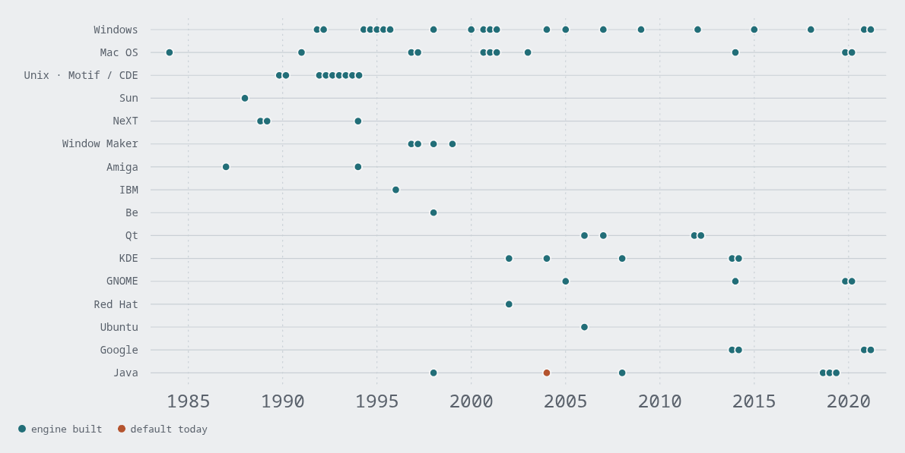

*Each dot is a pack, placed by the year its original shipped and the
platform it came from. The rust dot is the default, Metal (Ocean).*

Each theme also draws the window frame its original had, from the Mac's
close box to SourceGit's flat cells. The app paints its own title bar,
borders and buttons; the desktop still moves, resizes, snaps and closes
the window.

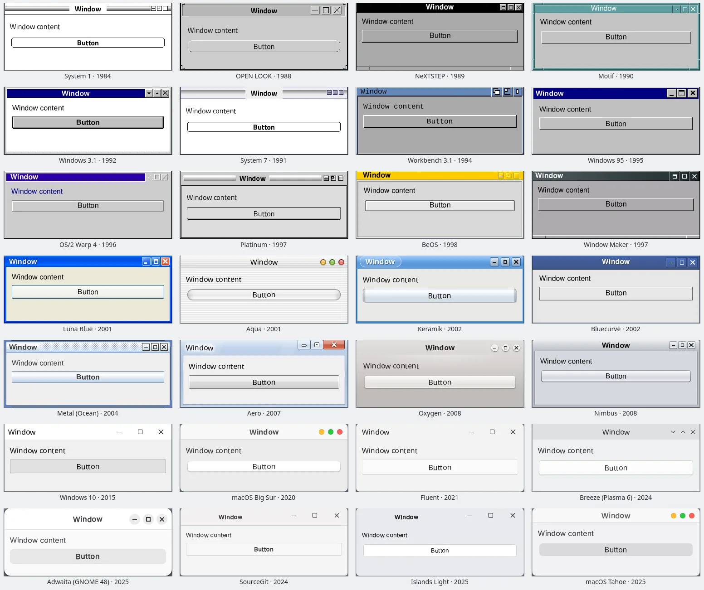

Every tile below is the same small app, the Settings window's preview,
drawn by its pack's engine. The two boxes at the right of its tool bar
are that window's own settings — the icon set and the size its glyphs
are drawn at — so they read the same in every tile.

### 1980s

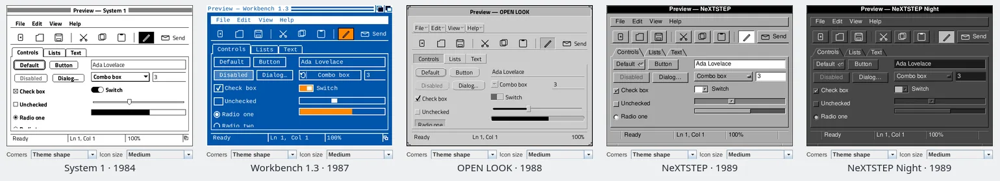

### 1990s

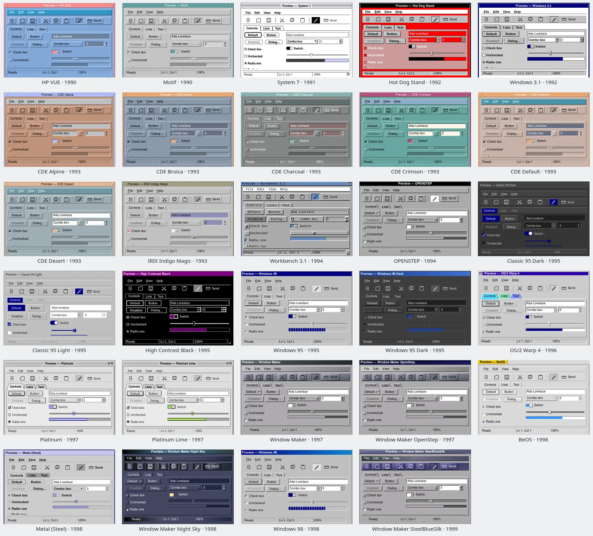

### 2000s

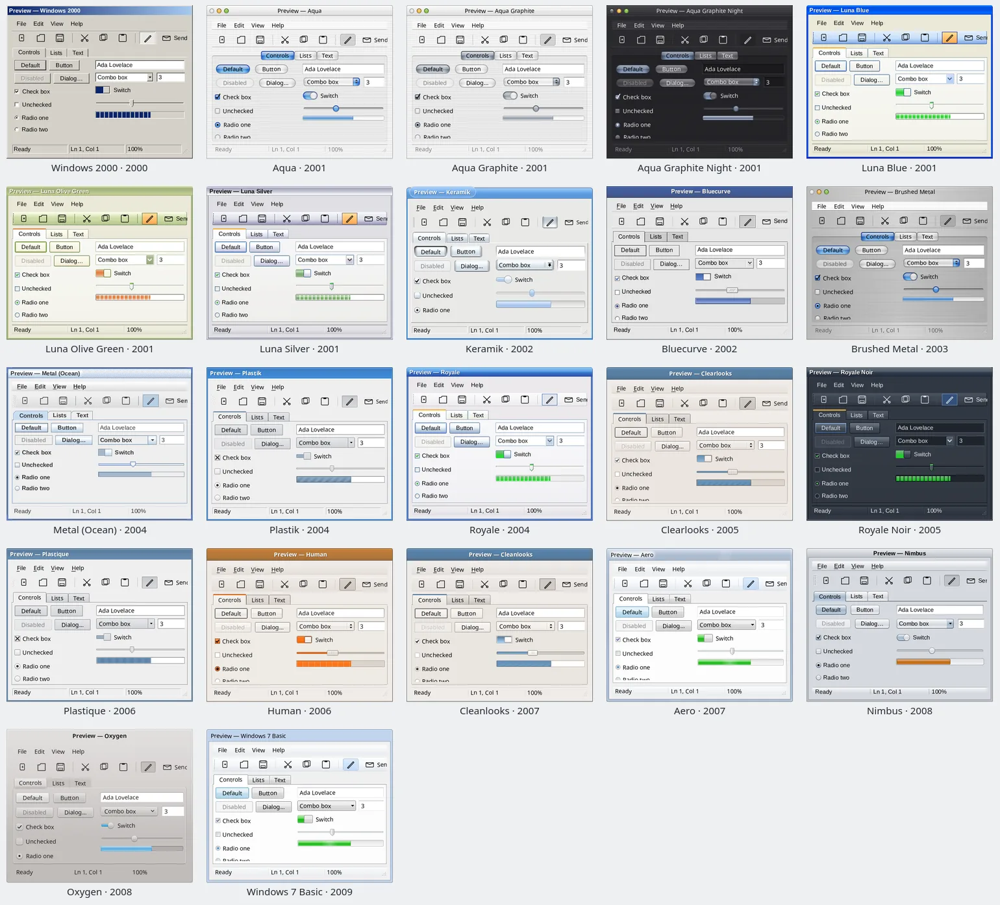

### 2010s

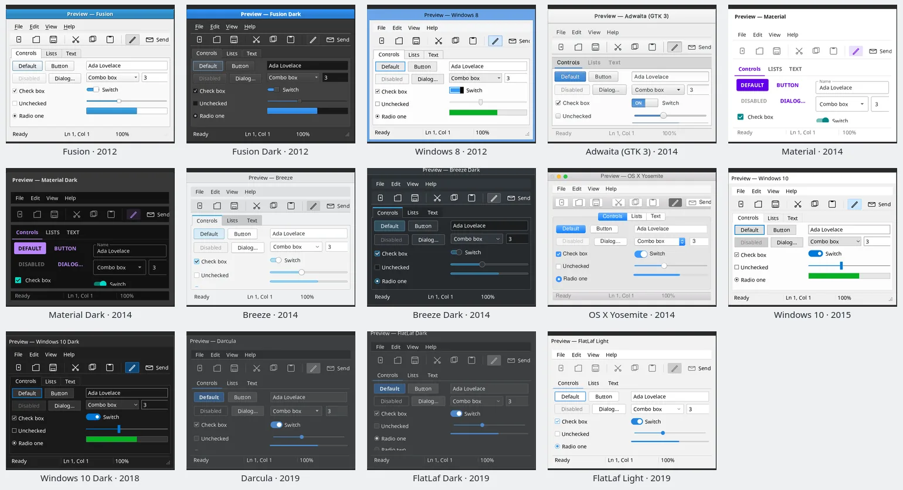

### 2020s

The platforms' latest eras are here too: KDE Plasma 6's Breeze, GNOME 48's
Adwaita, macOS 26 Tahoe's Liquid Glass and Material 3 Expressive.

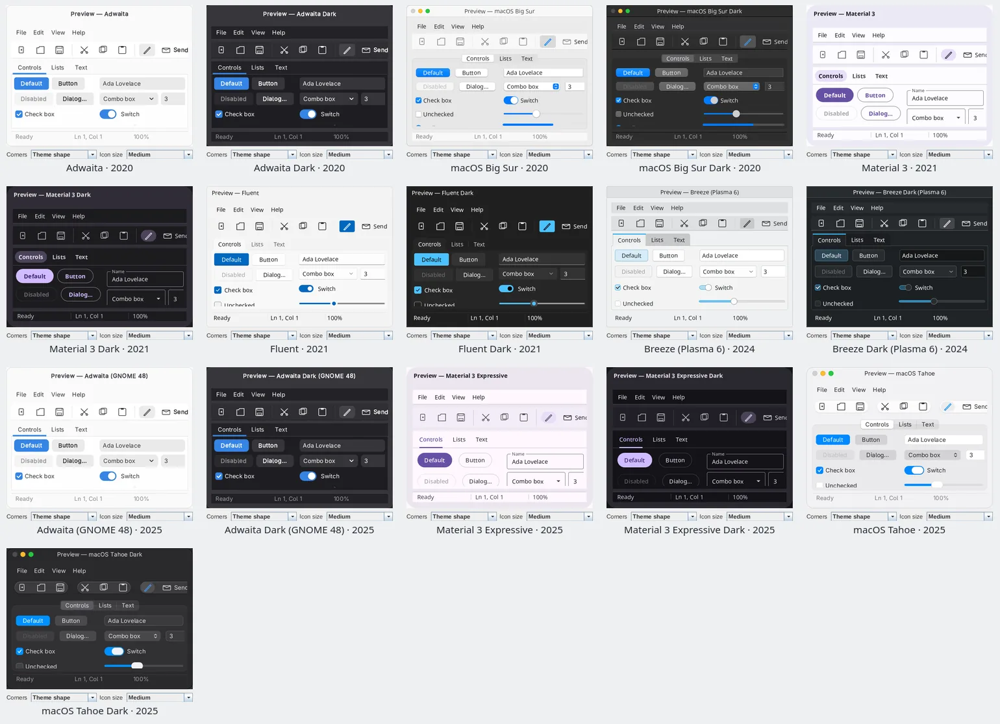

### The web and its apps

The web engine draws the looks developers live in today: the design
systems of GitHub (Primer), Vercel (Geist), shadcn/ui and Linear, VS
Code's 2026 themes and JetBrains' Islands, the editor palettes Dracula,
Nord, Tokyo Night, Catppuccin, Rosé Pine, Gruvbox, Solarized and Atom's
One, and SourceGit's own theme.

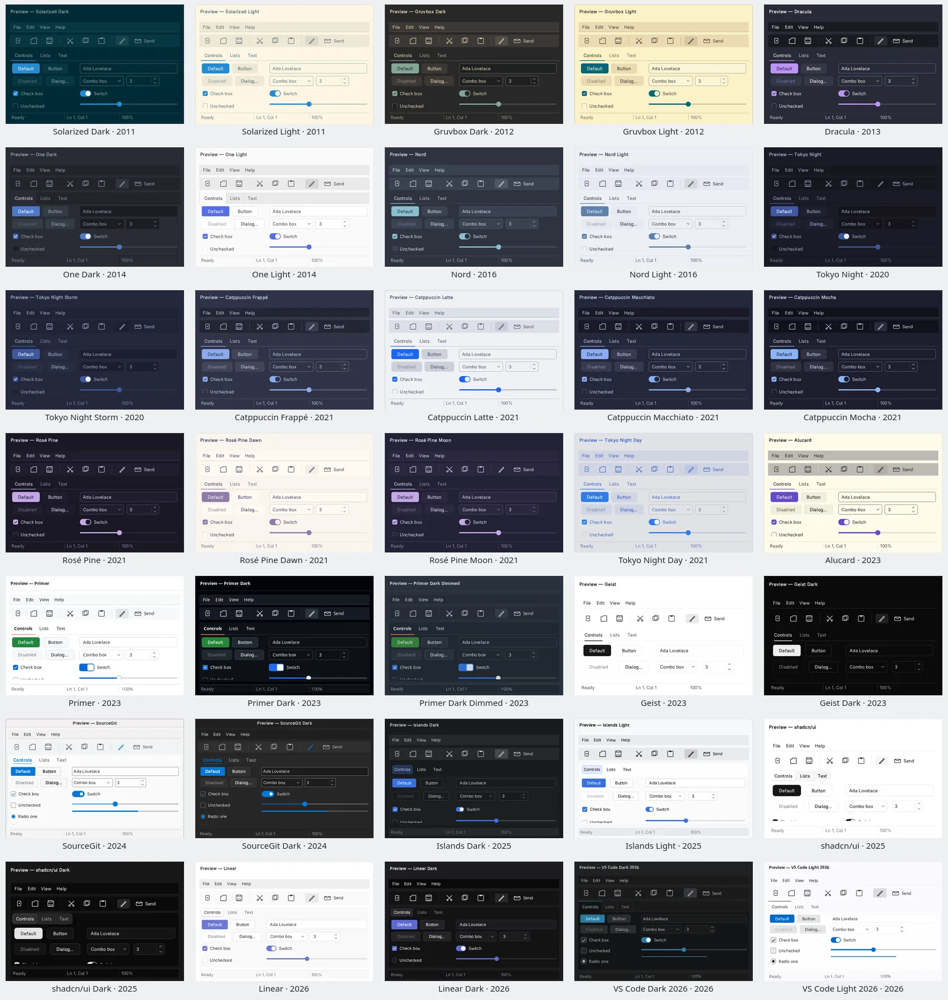

### Skins

Themes made of pictures, generated by the repo's own `cmd/uitk-skingen` so
the artwork is ours: Nocturne, the pixel-art Cassette, Deck (a window that is
not a rectangle), and the five the music player wears — Minim and the two
panels it switches to live, Minim Classic and Minim Silver, then Marquee and
Lantern. See [docs/skins.md](docs/skins.md).

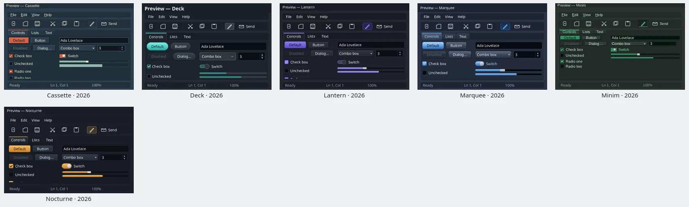

The full list, with what each pack reproduces, is in
[docs/themes.md](docs/themes.md). How engines work, and how to write one,
is in [docs/theme-engines.md](docs/theme-engines.md).

A **skin** is the other kind of theme: one made of pictures rather than
shapes — sprite sheets and geometry in the toolkit's own JSON, in the spirit
of WinAmp and VLC's skins2, with the things those formats never had (design
pixels that scale, a fixed vocabulary instead of a scripting language, and a
base pack painting whatever the skin leaves out). A skin is a pack like any
other: it lists in Settings, `UITK_THEME` runs an app in one, and it applies
live. Eight ship with the toolkit, five of them worn by the music player.

The generator that draws them is public API — `uitoolkit/skingen` — including
the art plan of every shipped pack, so a skin of your own is written the way
these were (draw the cells in Go; both scales and the manifest come out of
it) and can start as a fork of one of ours rather than as a blank PNG.
See [docs/skins.md](docs/skins.md).

## Screenshots

Real frames from the tour, Settings, the gallery, Notes, Inspector and
Files, and from the two applications that grew up here and now live in
repositories of their own, painted through paintengine2d with Titillium Web
(and JetBrains Mono in code views).

### The tour — what a window of this toolkit can do

The tabs are the window's own title bar, and pull out into windows of their
own; a page each for docking, drag and drop, frames, shaped windows, skins,
the desktop and accessibility, each with what the toolkit reports. See
**[docs/tour.md](docs/tour.md)**.

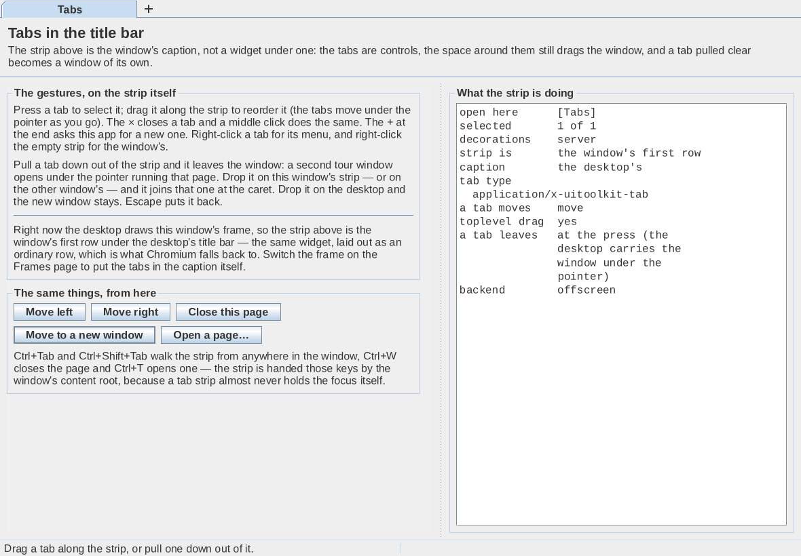

| | |
|---|---|
| 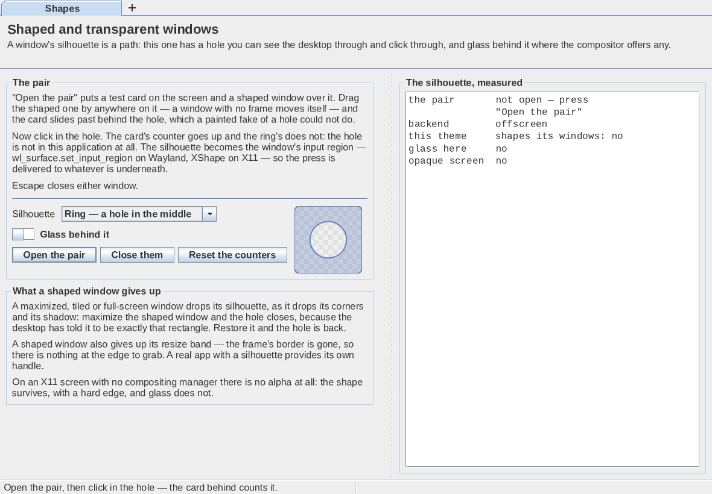 | 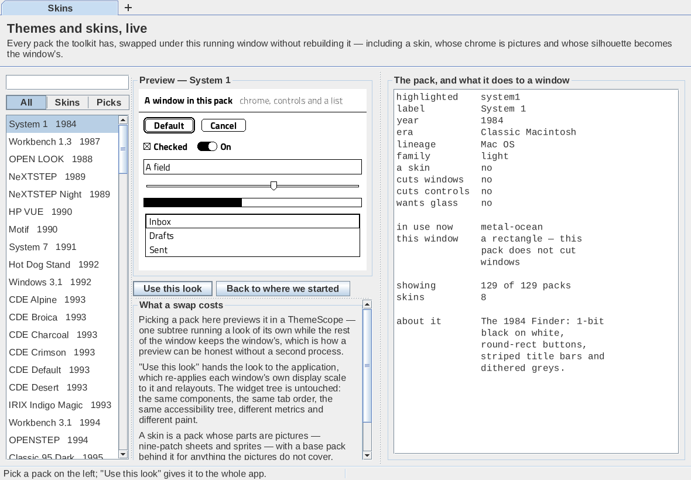 |

### Built with uitoolkit — the music player

A skinned, shaped, multi-window media player in the repo's own art, and the
toolkit's shop window for skins, shaped windows and windows that snap. It
lives in **[codemodify/media-player-music](https://github.com/codemodify/media-player-music)**
and builds against the published module; its three faces — Minim, Marquee
and Lantern — began here, and the eight skins they wear are still the
toolkit's. Minim in its three skins, each as the strip, the equaliser and
the playlist snapped together:

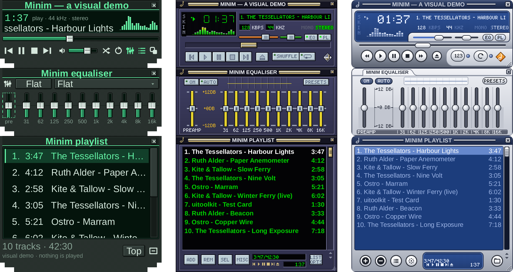

| | |
|---|---|
| 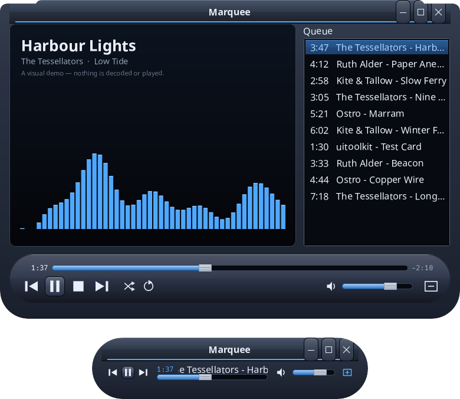 | 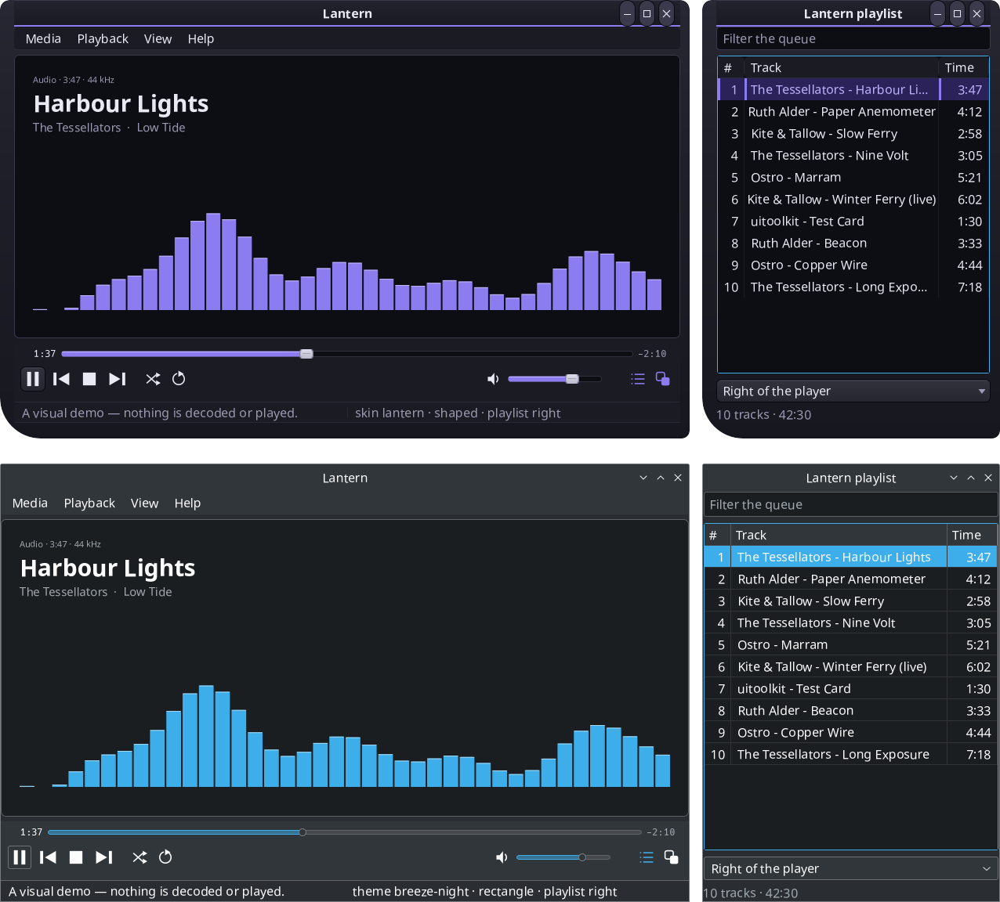 |
| **Marquee** — the cabinet, and folded down | **Lantern** — in its skin, and with it dropped |

What the toolkit does for it — skins, slots, silhouettes and `rack` — is in
**[docs/players.md](docs/players.md)**; how to run it is in its own
repository.

### Widget gallery — dark


### Widget gallery — light


### Themed controls


### Scrollable content


### Dialog overlay


### MenuBar drop-down


### TreeView


### ToolBar


### ComboBox drop-down


### MessageBox


### TableView


### File picker stub


### Tooltip


### TextArea


### Accordion / Switch


### Notes — a small desktop app


### Inspector — preferences sample


### Settings — the theme browser

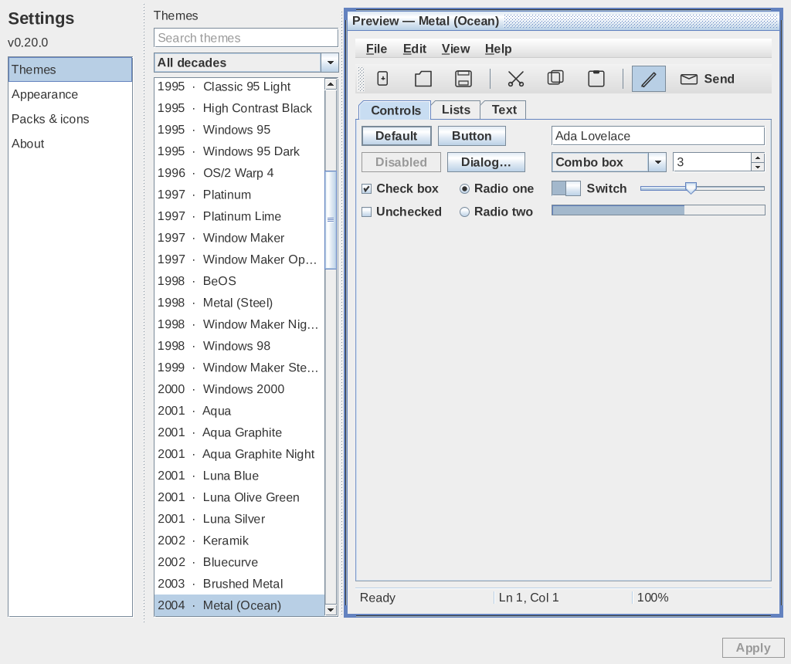

Search or filter 129 packs, and the one you pick is drawn at once as a
live application window beside the list — frame, caption and every
control — in a splitter you can size. That window is also where its icon
set, its icon size and its corner style are chosen: the thing that shows
a setting is the thing that sets it. See
**[docs/settings.md](docs/settings.md)**.

### Files — projects dogfood


### Built with uitoolkit — the mail client

A Thunderbird-chrome three-pane mail client: a daemon that owns the store
and speaks IMAP/POP3/SMTP, and a UI process that is chrome only. It lives in
**[codemodify/comms-mail](https://github.com/codemodify/comms-mail)** and
builds against the published module. It drove `CardList`, the virtualized
tree/table/list rows, the tray and much of the menu work below.

| | |
|---|---|
|  |  |
| **Dark** — three-pane, threaded, tags and attachments | **Light** — the same store, a different pack |

### Font roles — Titillium Web + JetBrains Mono


LookAndFeel locks **UI → Titillium Web** and **Mono → JetBrains Mono**
(OFL, embedded). mononoki is not the default mono face.

Name-by-name map vs Qt / GTK / Avalonia / Fyne / WinForms / WPF / Apple:
[Widget comparison](#widget-comparison) · [docs/widgets.md](docs/widgets.md).
Chrome behavior (focus-visible, toolbar gaps, toggle vs action, menu
dismiss) vs Avalonia / Qt / GTK: [docs/compare.md](docs/compare.md)
(`go run ./cmd/uitest-driver -compare`).

Regenerate:

```bash
go run ./cmd/uitk-shots docs/screenshots
tools/shots/demos.sh    # the tour and Settings, headless, as WebP
```

The application shots come from the applications: `comms-mail-demo
-screenshot docs/screenshots` in
[comms-mail](https://github.com/codemodify/comms-mail), and the player's own
`-shot` in
[media-player-music](https://github.com/codemodify/media-player-music).

## Quickstart

```bash
git clone https://github.com/codemodify/uitoolkit.git
cd uitoolkit
CGO_ENABLED=0 go test ./...
go run ./cmd/uitest-driver -short    # headless showcase + Settings
go run ./examples/uitoolkit-sample-tour               # the tour: a page per capability
go run ./examples/uitoolkit-sample-tour -page shapes  # one page of it
go run ./examples/uitoolkit-sample-tour -page controls  # every widget, one page
UITK_BACKEND=x11 go run ./examples/uitoolkit-sample-tour
UITK_BACKEND=wayland go run ./examples/uitoolkit-sample-tour
UITK_PAINT=auto go run ./examples/uitoolkit-sample-tour   # default: GPU if EGL works
UITK_PAINT=cpu go run ./examples/uitoolkit-sample-tour    # v0.4.1 CPU present
UITK_SCENE=off go run ./examples/uitoolkit-sample-tour    # v0.5 immediate paint (no scene graph)
go run ./cmd/uitk-shots -gallery gallery.png  # the showcase alone, offscreen
go run ./examples/uitoolkit-sample-notes
go run ./examples/uitoolkit-sample-inspector
go run ./examples/uitoolkit-sample-files
go run ./examples/uitoolkit-sample-files -headless   # writes files.png
go run ./cmd/uitoolkit-settings                     # theme browser, live preview, look.json
go run ./cmd/uitoolkit-settings -stage aqua         # open with Aqua staged
go run ./cmd/uitoolkit-settings -page appearance    # open scrolled to the shape options
go run ./cmd/uitoolkit-settings -headless           # writes settings.png
```

## Testing

See **[docs/testing.md](docs/testing.md)** for how to run the suite and
what the app driver covers.

```bash
CGO_ENABLED=0 go test ./...
go run ./cmd/uitest-driver           # showcase + Settings
CGO_ENABLED=1 go build ./examples/uitoolkit-sample-tour   # Linux CGO / Wayland
```

When you fix a UI bug, add a regression test. Headless / CI paints into
`paintengine2d.NewImage` and can `Window.WritePNG`.
`UITK_PAINT=auto` (default) tries paintengine2d **GPUDevice** (Linux EGL/GLES2)
and falls back to CPU. On Linux with CGO a GPU window presents with
**eglSwapBuffers** (`wl_egl_window` on Wayland, EGL window on X11). If EGL
fails, present is the v0.4.1 CPU path: **XPutImage** on X11, **wl_shm
XRGB8888** on Wayland (`UITK_WAYLAND_PRESENT=auto|shm`).
`UITK_WAYLAND_PRESENT=dmabuf` opts into linux-dmabuf on the CPU path.
`UITK_PAINT=cpu` forces the CPU painter. If a Wayland window is fully
transparent, set `UITK_PAINT=cpu` and/or `UITK_WAYLAND_PRESENT=shm`.
`Application.Run` waits on the display fd (not a 16 ms ticker) and skips
`Present` when damage is empty. Default `UITK_SCENE` records a retained
graph (`Recorder` / `DrawScene`); `UITK_SCENE=off` is the immediate path.
See [docs/platform.md](docs/platform.md).
Auto-select is `WAYLAND_DISPLAY` → `DISPLAY` → offscreen. Scale comes from
`UITK_SCALE` / `GDK_SCALE` / `QT_SCALE_FACTOR` / `GDK_DPI_SCALE`, else
Xft.dpi / RandR on X11 or `wl_output` / fractional-scale on Wayland.
Ctrl+C/X/V and middle-click use the **OS clipboard** on both X11
(CLIPBOARD + PRIMARY, including INCR) and Wayland (`wl_data_device`,
plus primary when the compositor supports it). CJK IME preedit is wired
through XIM callbacks and `text-input-v3` into TextField / TextArea.

## How it uses paintengine2d

uitoolkit does not rasterize. A window paints through paintengine2d
`Context` → `Device`. `UITK_PAINT=auto` binds `GPUDevice` to the native
window when EGL works; otherwise the window owns a premul RGBA pixmap.

When damage is non-empty:

1. Widgets call `Invalidate` → dirty boxes land in `paintengine2d.Damage`.
2. `Context` is created on the Device; `QuickReject` / clip skip clean regions.
3. Each component `Paint`s with `DrawRoundRect`, `Fill`, `Stroke`, gradients,
   and `DrawGlyphs` (shared white atlas, themed with `Paint.Color` tint).
4. Present is **eglSwapBuffers** on a GPU window, else X11 `XPutImage` /
   MIT-SHM or Wayland `wl_shm` (opt-in dmabuf). Offscreen present is a no-op.

```
Desktop app
    → uitoolkit (widgets, layout, focus, X11 / Wayland / offscreen)
        → paintengine2d.Context / Device / Damage / FontAtlas
            → GPUDevice (EGL/GLES2) or CPU scanline AA pixmap
```

Default chrome uses Titillium Web outlines (not the old 5×7 bitmap atlas).
Inspector tables and code previews use JetBrains Mono. **v0.7.2+ blit RGB
tint** is required. **v0.8.0** adds the GPU Device. One white atlas per family+weight+size is shared;
`DrawGlyphs` receives the theme Color. `style.GlyphTint` asserts the engine
actually multiplies RGB. `TestDefaultFontsRender` draws both families and
fails if the TTFs are missing or the ink is chunky 1-bit.

## Architecture

Inspired by JUCE `Component` + `LookAndFeel`, Evas damage, and Avalonia’s
retained tree (ideas only — no copied code).

```
platform   window + event pump + present          Linux X11 (EGL or XPutImage,
           (thin OS glue)                         CLIPBOARD+PRIMARY, XIM) and
                                                  Wayland (wl_egl_window or
                                                  wl_shm, xdg-shell, seat);
                                                  Win / macOS stubs
app        Application run loop, windows,         DPI/scale, backend select,
                                                  input routing
           capture / WritePNG
widget     retained Component: bounds, children,  HitTest, focus, Invalidate
           Paint(ctx *paintengine2d.Context)
layout     Measure / Arrange                      row, column, stack, flex
widgets    Button, Label, TextField, TextArea     ScrollView, ListView, TableView
           NumberField, Checkbox, Switch, Slider  MenuBar, TabView, TreeView
           Panel, Splitter, Overlay, Separator    StatusBar, ToolBar, ComboBox
           Accordion, Expander, Spacer            ProgressBar, RadioGroup
           MessageBox, FileDialog stub, Tooltip   TitleBar, context menus
           CardList
style      LookAndFeel + Palette + Metrics        Color themes + corners +
                                                  PNG icon sets
                                                  (~/.config/uitoolkit/icons/)
```

Swap the skin with `Application.SetLook(uitoolkit.LightLook())` or
`PreferredLook()` (XDG `look.json` theme + icons from **Settings**). `New`
watches that file when Look is omitted so Apply updates running apps.
Controls never hard-code colors. See [docs/settings.md](docs/settings.md).

## Widget comparison

Public controls from [`export.go`](export.go), matched **by name** to stock
widgets in other desktop kits. This is a name map, not feature parity.
**≈** = not 1:1. **—** = no stock equivalent.

Full notes, layout primitives, and official doc links:
**[docs/widgets.md](docs/widgets.md)**.

Thumbs are uitoolkit frames, from `docs/screenshots/compare/` plus the
gallery. Other-toolkit screenshots are **not** embedded (proprietary /
unclear docs licenses) — follow the doc links in `docs/widgets.md`.

Apple columns are names only (AppKit/SwiftUI backends are still stubs).

| Widget | uitoolkit | Qt (Widgets / Quick) | GTK 4 | Avalonia | Fyne | WinForms | WPF | AppKit | SwiftUI | Screenshot |
| --- | --- | --- | --- | --- | --- | --- | --- | --- | --- | --- |
| Label | `Label` / `Title` | `QLabel` / `Text` | `GtkLabel` | `TextBlock` | `widget.Label` | `Label` | `TextBlock` | `NSTextField` | `Text` | 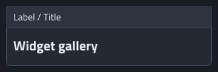 |
| Button | `Button` | `QPushButton` / `Button` | `GtkButton` | `Button` | `widget.Button` | `Button` | `Button` | `NSButton` | `Button` | 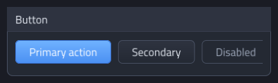 |
| Checkbox | `Checkbox` | `QCheckBox` / `CheckBox` | `GtkCheckButton` | `CheckBox` | `widget.Check` | `CheckBox` | `CheckBox` | `NSButton` (checkbox) | `Toggle` ≈ | 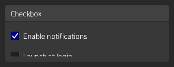 |
| Switch | `Switch` | `Switch` (Quick); Widgets ≈ | `GtkSwitch` | `ToggleSwitch` | `widget.Check` ≈ | — | `ToggleButton` ≈ | `NSSwitch` | `Toggle` | 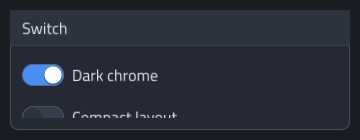 |
| Radio | `RadioButton` / `RadioGroup` | `QRadioButton` / `RadioButton` | `GtkCheckButton` (group) | `RadioButton` | `widget.RadioGroup` | `RadioButton` | `RadioButton` | `NSButton` (radio) | `Picker` ≈ | 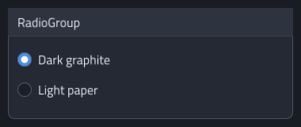 |
| Slider | `Slider` | `QSlider` / `Slider` | `GtkScale` | `Slider` | `widget.Slider` | `TrackBar` | `Slider` | `NSSlider` | `Slider` | 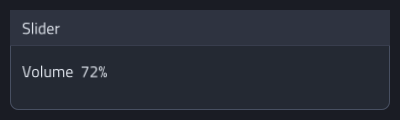 |
| Text field | `TextField` | `QLineEdit` / `TextField` | `GtkEntry` | `TextBox` | `widget.Entry` | `TextBox` | `TextBox` | `NSTextField` | `TextField` | 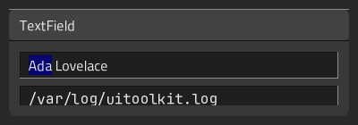 |
| Text area | `TextArea` | `QTextEdit` / `TextArea` | `GtkTextView` | `TextBox` ≈ | `widget.Entry` (MultiLine) | `TextBox` (Multiline) | `TextBox` | `NSTextView` | `TextEditor` | 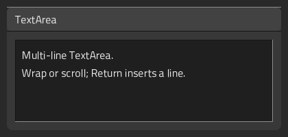 |
| Spinner | `NumberField` / `Spinner` | `QSpinBox` / `SpinBox` | `GtkSpinButton` | `NumericUpDown` | — | `NumericUpDown` | — | `NSStepper` + field | `Stepper` | 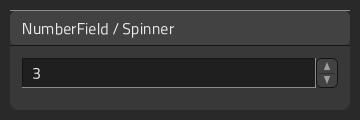 |
| Combo box | `ComboBox` | `QComboBox` / `ComboBox` | `GtkDropDown` | `ComboBox` | `widget.Select` | `ComboBox` | `ComboBox` | `NSComboBox` | `Picker` | 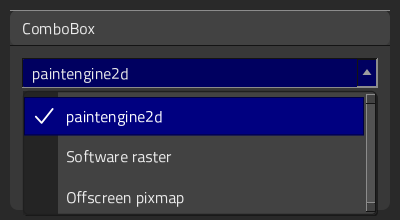 |
| Progress | `ProgressBar` / `BusyBar` | `QProgressBar` / `ProgressBar` | `GtkProgressBar` | `ProgressBar` | `widget.ProgressBar` | `ProgressBar` | `ProgressBar` | `NSProgressIndicator` | `ProgressView` | 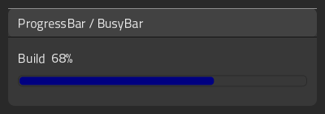 |
| List | `ListView` | `QListView` / `ListView` | `GtkListView` | `ListBox` | `widget.List` | `ListBox` | `ListBox` | `NSTableView` | `List` | 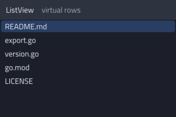 |
| Cards | `CardList` | `QListView` (delegate) ≈ | `GtkListBox` ≈ | `ItemsControl` ≈ | `widget.List` ≈ | — | `ItemsControl` ≈ | `NSCollectionView` ≈ | `List` ≈ | 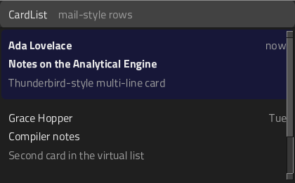 |
| Table | `TableView` | `QTableView` / `TableView` | `GtkColumnView` | `DataGrid` | `widget.Table` | `DataGridView` | `DataGrid` | `NSTableView` | `Table` | 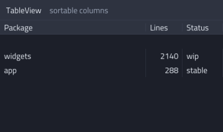 |
| Tree | `TreeView` | `QTreeView` / `TreeView` | `GtkListView` / `GtkTreeView` | `TreeView` | `widget.Tree` | `TreeView` | `TreeView` | `NSOutlineView` | `OutlineGroup` | 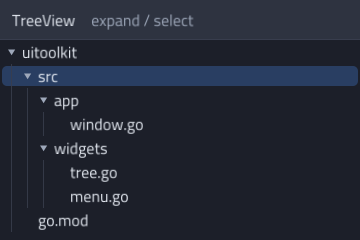 |
| Tabs | `TabView` / `TabBar` | `QTabWidget` / `TabBar` | `GtkNotebook` | `TabControl` | `container.AppTabs` | `TabControl` | `TabControl` | `NSTabView` | `TabView` | 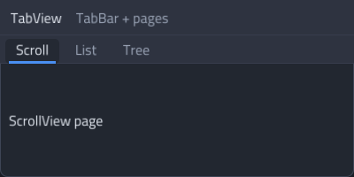 |
| Menu bar | `MenuBar` | `QMenuBar` / `MenuBar` | `GtkPopoverMenuBar` | `Menu` | `fyne.MainMenu` | `MenuStrip` | `Menu` | `NSMenu` | `Menu` | 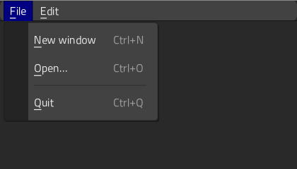 |
| Context menu | `PopupMenu` | `QMenu` / `Menu` | `GtkPopoverMenu` | `ContextMenu` | `widget.PopUpMenu` | `ContextMenuStrip` | `ContextMenu` | `NSMenu` | `contextMenu` | 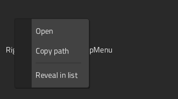 |
| Tool bar | `ToolBar` / `ToolToggle` | `QToolBar` + checkable tool | `GtkBox` ≈ + `GtkToggleButton` | `CommandBar` ≈ + `ToggleButton` | `widget.Toolbar` | `ToolStrip` | `ToolBar` | `NSToolbar` | `ToolbarItem` | 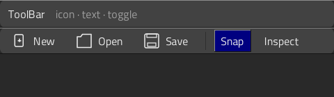 |
| Status bar | `StatusBar` | `QStatusBar` / `StatusBar` | `GtkStatusbar` ≈ | — | — | `StatusStrip` | `StatusBar` | — | — | 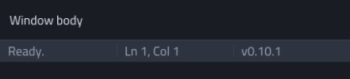 |
| Title bar | `TitleBar` | custom ≈ | `GtkHeaderBar` ≈ | chrome ≈ | window title ≈ | `Form.Text` ≈ | chrome ≈ | window title | `navigationTitle` | 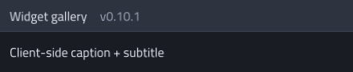 |
| Scroll | `ScrollView` | `QScrollArea` / `ScrollView` | `GtkScrolledWindow` | `ScrollViewer` | `container.Scroll` | `AutoScroll` | `ScrollViewer` | `NSScrollView` | `ScrollView` | 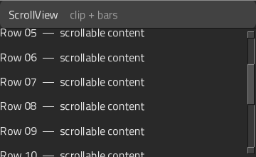 |
| Splitter | `Splitter` | `QSplitter` / `SplitView` | `GtkPaned` | `GridSplitter` | `container.Split` | `SplitContainer` | `GridSplitter` | `NSSplitView` | `HSplitView` | 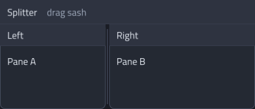 |
| Panel | `Panel` | `QGroupBox` / `GroupBox` | `GtkFrame` | headered ≈ | `widget.Card` ≈ | `GroupBox` | `GroupBox` | `NSBox` | `GroupBox` | 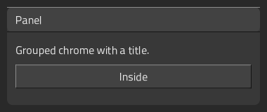 |
| Accordion | `Accordion` / `Expander` | `QToolBox` ≈ | `GtkExpander` | `Expander` | `widget.Accordion` | — | `Expander` | disclosure ≈ | `DisclosureGroup` | 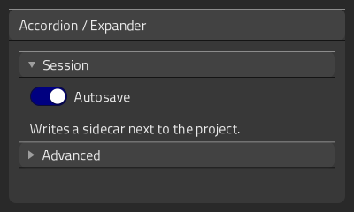 |
| Message box | `MessageBox` | `QMessageBox` / `MessageDialog` | `GtkAlertDialog` | dialog ≈ | `dialog.NewInformation` | `MessageBox` | `MessageBox` | `NSAlert` | `alert` | 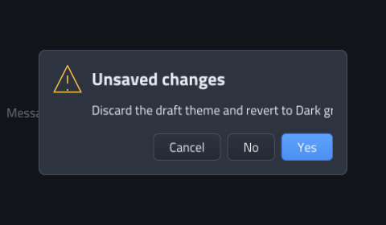 |
| File picker | `FileDialog` (stub) | `QFileDialog` / `FileDialog` | `GtkFileDialog` | `OpenFileDialog` | `dialog.NewFileOpen` | `OpenFileDialog` | `OpenFileDialog` | `NSOpenPanel` | `fileImporter` | 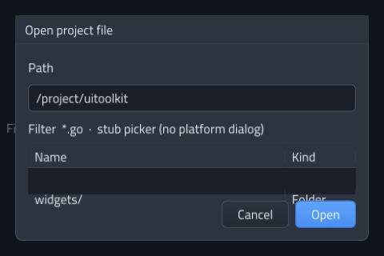 |
| Tooltip | `Tip` | `QToolTip` / `ToolTip` | tooltip | `ToolTip` | tooltip | `ToolTip` | `ToolTip` | tooltip | `.help()` | 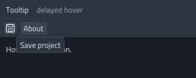 |
| Flex / rules | `Column` `Row` `Separator` `Spacer` | box layout / `QFrame` | `GtkBox` / `GtkSeparator` | `StackPanel` / `Separator` | `VBox` / `Separator` | layout panels | `StackPanel` / `Separator` | `NSStackView` | `VStack` / `Divider` / `Spacer` | 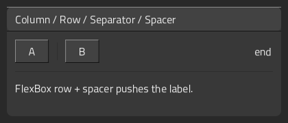 |

`FileDialog` is an in-process stub (list + path), not a native portal.
`CardList` is the mail-client-style virtualized multi-line row, not a generic card
container. Layout extras (`Stack`, `Pad`, `Overlay`) are in
[docs/widgets.md](docs/widgets.md).

## Examples

Every example under `examples/` is a whole application, written against
the published API and nothing else. There is no privileged import: what
these programs call, `go get github.com/codemodify/uitoolkit` gives you,
so any of them can be copied into a directory of your own and built.

Each one is a short `main.go` that opens a window, and a package beside it
holding the application — because that is how an application of any size is
written, and because a sample whose code all lives in `func main` teaches
nothing about where code goes.

A sample's binary is named after its directory, and every one of those
directories is prefixed `uitoolkit-sample-`: `go build ./examples/...`
leaves `uitoolkit-sample-tour`, `uitoolkit-sample-files` and the rest,
rather than a `tour`, a `files` and a `notes` that would collide with
whatever is already on somebody's `$PATH`. The commands under `cmd/` are
real programs rather than samples and keep the names they are installed
under.

| Command | The application | What it proves |
| --- | --- | --- |
| `go run ./examples/uitoolkit-sample-tour` | [`examples/uitoolkit-sample-tour/tourapp`](examples/uitoolkit-sample-tour/tourapp) | Every widget the toolkit has, over three pages built on the public [`showcase`](showcase) package — the controls, the views that hold rows, the documents — and then everything a page of controls cannot show, a page each: tabs that **are** the window's caption and tear out into windows of their own, docking, a drag that leaves the process, the toolkit's frame against the desktop's, a window with a hole you can click through, skins swapped live, the tray and the clipboard, and the window's own accessibility tree. See [docs/tour.md](docs/tour.md) |
| `go run ./examples/uitoolkit-sample-notes` | [`examples/uitoolkit-sample-notes/notesapp`](examples/uitoolkit-sample-notes/notesapp) | A small real app: sortable table, textarea body, priority spinner, file stub, tooltips |
| `go run ./examples/uitoolkit-sample-inspector` | [`examples/uitoolkit-sample-inspector/inspectorapp`](examples/uitoolkit-sample-inspector/inspectorapp) | Preferences inspector: panels that dock, float and close, a layout remembered between runs with `dock.Host.SaveLayoutFile`, table (JetBrains Mono), toolbar, message box |
| `go run ./examples/uitoolkit-sample-files` | [`examples/uitoolkit-sample-files/filesapp`](examples/uitoolkit-sample-files/filesapp) | Files / Projects dogfood: tree, table, toolbar, menus, TextArea preview, history, drag and drop, dialogs |
| `go run ./cmd/uitoolkit-settings` | [`cmd/uitoolkit-settings/settingsapp`](cmd/uitoolkit-settings/settingsapp) | The appearance editor, one page: the theme browser down a column, and beside it a live application window that sets three of the things it shows — its icon set, icon size and corners on a bar of its own — with the five on/off options in a row over it and `look.json` under it. See [docs/settings.md](docs/settings.md) |

`examples/uitoolkit-sample-mdi`, `examples/uitoolkit-sample-popups`,
`examples/uitoolkit-sample-richtext`, `examples/uitoolkit-sample-shapes`,
`examples/uitoolkit-sample-skinshape` and `examples/uitoolkit-sample-wizard`
are single-file programs: one widget or one idea each, small enough to read
in a sitting.

A test in the root package fails the build if anything under `examples/`
or `cmd/` ever imports one of the toolkit's `internal/` packages again —
the rule the samples exist to prove.

```bash
go run ./cmd/uitk-shots docs/screenshots   # the pictures on this page
tools/shots/demos.sh                       # the tour's pages and sheet, and Settings
```

### Applications built with uitoolkit

Two applications grew up in this repository and have moved into their own.
Both build against the published module — no `replace`, no internal
imports — which is the useful part: they are proof the public API is enough
to write a real desktop application with.

| Application | What it proves |
| --- | --- |
| [**comms-mail**](https://github.com/codemodify/comms-mail) | A Thunderbird-chrome mail client, split into a daemon (store, IMAP/POP3/SMTP, OAuth) and a chrome-only UI: menu bar, folder tree, virtualized thread table, card list, preview and attachments, compose and preferences windows, a tray item and desktop notifications |
| [**media-player-music**](https://github.com/codemodify/media-player-music) | One skinned media player whose face switches at runtime between Minim, Marquee and Lantern: skins as packs, silhouettes stated in design pixels, a caption an app sizes itself, art on ordinary controls, and satellite windows that snap with `rack`. It decodes and plays nothing — there is no media dependency in this toolkit |

Run instructions live in those repositories. What the *toolkit* gives them —
skins, slots, shaped windows, snapping — is in
[docs/players.md](docs/players.md).

## Tests

```bash
CGO_ENABLED=0 go test ./...
```

Coverage includes flex Measure/Arrange (parent-local coords), hit-test
z-order, focus tab order (including MenuBar / TabBar / TreeView),
checkbox/slider/text/button/switch interaction, virtual list range, scroll-wheel
bubbling, scrollbar track hits, text selection and copy/paste (in-process, plus OS clipboard on X11), menu
and tab swap, tree expand/select, context-menu dispatch, toolbar and
combo, radio groups, progress clamp, message-box results, table sort,
number-field step/filter, file-dialog stub, delayed tooltips, Esc
dismiss order, textarea newline/wrap/nav, switch toggle (including
disabled), accordion exclusive expand and focus yield, expander
relayout, separator and spacer measure, IME preedit/commit on text
widgets, and an offscreen paint that produces real pixels.
`go test ./cmd/uitk-shots` regenerates the gallery and compare thumbs and
fails if any two share a blob.

Keyboard map: [docs/keyboard.md](docs/keyboard.md). **Esc** closes
tooltip → popup → overlay, everywhere.

## Positioning

**uitoolkit** is a desktop widget kit on **your own Go paint engine**:
pure Go, retained tree, paintengine2d pixels, Linux X11 and Wayland. It is not
Fyne (GL + batteries), not Gio (ops + GPU), not Wails (Go + webview).

| | Paint | Windowing | Model | CGO |
| --- | --- | --- | --- | --- |
| **uitoolkit** | paintengine2d (CPU AA + Linux EGL/GLES2) | X11 + Wayland + offscreen | Retained, themed | Optional (X11/Wayland/EGL) |
| [Fyne](https://fyne.io) | Own + OpenGL | Cross-platform | Retained | Yes (GL) |
| [Gio](https://gioui.org) | Own ops renderer | Cross-platform | Immediate | Optional |
| [Wails](https://wails.io) | Browser / WebView | Cross-platform | HTML/CSS + Go | Yes (webview) |

Choose uitoolkit when you want **pure Go pixels you own**, a retained tree
with damage, and no browser runtime. Linux windowing is X11 or Wayland;
Win32 and AppKit are still stubs. Choose Fyne or Gio for mature
cross-platform backends today; choose Wails when the UI should be a webview.

## Out of scope

Documented on purpose — do not expect these yet:

- Full accessibility (AT-SPI / VoiceOver)
- IME candidate-window theming (ibus / fcitx / compositor draw their own)
- Mobile and webview
- Win32 and AppKit backends (interfaces + stubs only)
- HarfBuzz / complex shaping (NullShaper + OpenType outlines)

See [docs/platform.md](docs/platform.md) for X11 vs Wayland vs offscreen.

The version trail below and the changelog under it are history, written
when each release was cut. Mail and the players were in this repository
then; both have since moved out — to
[comms-mail](https://github.com/codemodify/comms-mail) and
[media-player-music](https://github.com/codemodify/media-player-music) —
and the entries naming `examples/mail`, `mailclientd`, `mailclientui`,
`examples/minim`, `marquee` or `lantern` are records of where the toolkit
work came from, not of paths that still exist here.

Linux desktop clipboard, IME preedit, and HiDPI are implemented on both
X11 and Wayland as of **v0.3.0**. GPU present (`UITK_PAINT=auto`) is **v0.5.0**.
Event-driven `Run` (wait on the display fd) is **v0.5.1**.
Retained scene graph (Qt Quick / GSK lite) is **v0.6.0**.
Virtualized list/table/tree row reuse is **v0.6.1**.
Mail process split (mailclientd + mailclientui) is **v0.8.0**.
HiDPI-stable list/table/tree rows and Wayland resize are **v0.8.1**.
Mail thread-list column flex (readable subjects) is **v0.8.2**.
Mail cards / density / Unified Inbox / tags / filters / identities and
IMAP+SMTP with an on-disk cache are **v0.9.0**. Empty-by-default first-run
and text-only message view are **v0.9.1**. Mail Tier A+B (OAuth, IDLE/QRESYNC,
outbox, smart folders, threading/mute, VIP, notify, categories) is **v0.10.0**.
Cross-toolkit widget name map + compare thumbs is **v0.10.1**.
Wayland TextField typing (xkb `EventText` while text-input is idle) and
Add Account typed passwords in `mail.json` (mode `0600`) are **v0.10.2**.
Add Account IMAP vs POP3, Test connection / auto-detect, and POP3 inbox
retrieve are **v0.10.3**. Mail folder tree drops Unified / Smart / Categories
chrome and message open no longer rebuilds the list (**v0.10.4**).
Splitter pane clip, overflow scrollbars, scroll clamp, and read-only
`TextView` are **v0.10.5**. Table/list body clip (flush under the header,
rows stay visible past the first page) and restoring the pointer after a
splitter drag are **v0.10.6**. Headless widget contracts, `uitest-driver`,
and the Wayland cursor `C.int` stride fix are **v0.10.7**.
Popup menus size to the widest label and full item list (scroll if the
screen clamps them); Mail hides the status bar and path strip, moves Quick
Filter under the toolbar, and drops the VIP folder from the tree (**v0.10.8**).
Mail thread columns are Topic / Who / When (no Size); ★ / 📎 paint after
toggle via toolkit font fallbacks + TableView / CardList invalidation (**v0.10.9**).
Mail drops the sidebar Account ComboBox, Folders section header, and
the active-filter banner above the thread list; preview attachments
gain Open / Save As (click selects, double-click opens). MenuBar popups
shift horizontally at the window edge instead of cropping labels
(**v0.10.10**). Preview attachment **Open** / **Save As** sit inline on
each row; the shared pair is replaced by **Save All** (one folder pick,
then write every attachment). Tag / Archive / Junk / Delete sit above
the thread header; Quick Filter moves into the main toolbar after
Classic (**v0.10.11**). `ToolBar.Measure` returns intrinsic width so a
flex spacer can right-align siblings; Mail Quick Filter stays visible
on the right (**v0.10.12**). Context menus size to the full label plus
check column, padding, and frame so “Add sender to VIP” is not clipped
(**v0.10.13**). Settings (`cmd/uitoolkit-settings`) is a first-class Appearance
editor: Dark / Light, round / square corners, Classic / Sharp icon sets,
persisted as `$XDG_CONFIG_HOME/uitoolkit/look.json` (**v0.11.0**).
Settings has no menu bar; radios preview locally and **Apply** writes
the file. Running apps that use `PreferredLook` (default `New`) watch
`look.json` and `SetLook` without a restart (**v0.11.1**). Named
installable theme packs replace the Theme / Corners / Icons triad:
`look.json` stores a pack name, eight starters are embedded, and
Settings can export the current look to
`~/.config/uitoolkit/themes/<name>/theme.json` (**v0.11.2**). Mail chrome
prefs no longer rewrite `look.json`; Settings → Apply updates a running
Mail with `WatchLook` (**v0.11.3**). File SVG icon sets (`filled` /
`outline` / `duotone`) lived in the repo and were copied by hand into
`~/.config/uitoolkit/icons/<set>/` (**v0.12.0**). Those SVGs are
replaced by premiere PNG packs (**v0.12.1**). Theme, corners, and icons
are independent look.json fields again; compound pack names migrate
(**v0.12.2**).

## Version

**0.20.0** — **The first release meant to be depended on from outside this
repository.** Everything below follows from one rule the author set on
22 September: the sample applications are this toolkit's first customer, and
they may use only what anybody else can use.

*Applications moved out, and proved the API.* Mail
([comms-mail](https://github.com/codemodify/comms-mail), 26k lines, a daemon
that links **zero** toolkit packages plus a GUI) and the three players, merged
into one application whose face switches at runtime
([media-player-music](https://github.com/codemodify/media-player-music)), now
live in their own repositories. A third, [comms-chat-lan](https://github.com/codemodify/comms-chat-lan),
was written from scratch against the published module: a LAN chat server, a
client daemon, a uitoolkit window and a terminal front end. All three build
against a tagged or pseudo-versioned uitoolkit with **no `replace` directive
and no internal imports**. Nothing they needed was missing — which is a
completeness test no amount of internal review substitutes for, and it is
where most of the API below came from.

*The examples are real code now.* `internal/demo` — 10,853 lines holding the
whole implementation of six samples while `examples/*/main.go` were 39-line
shells in front of them — is gone. Each sample owns its code
(`examples/uitoolkit-sample-files/filesapp`, `examples/uitoolkit-sample-notes/notesapp`,
`examples/uitoolkit-sample-inspector/inspectorapp`, `examples/uitoolkit-sample-tour/tourapp`,
`cmd/uitoolkit-settings/settingsapp`), so an example can be read, copied and built
by somebody learning the toolkit. `TestSamplesUseOnlyThePublicAPI` fails the
build if anything under `examples/` or `cmd/` reaches into the toolkit's
internal tree again: the rule had been broken twice, so it is enforced rather
than remembered.

*Art on ordinary controls.* `widgets.Button` and the new
`widgets.ToolButton` take a `Painter` (replace the look's face entirely) and a
`Content` painter (draw inside the face the engine already drew, keeping its
hover cross-fade), plus a `Shaper` for the hit shape. `widgets.Slider` gained
`Painter`, `Travel`, `Vertical`, `Label`, `Format`, `Tip`, `Step`, `Page` and
`Reading()`. `widgets.ListView` gained `RowGeo`, `RowPaint`, `ScrollPaint` and
`ItemDetail`. Together these retired two of the three hand-rolled widgets the
player samples had needed — a 240-line glyph button and a 290-line fader
became the stock widgets with a painter.

*Telling the user's edits from the app's.* Nine widgets fire `OnChange`
whenever a value changes, which means an application driving a control from
its own data re-enters its own handler. They now also carry **`OnInput`**,
fired only when the change came from a person — pointer, keyboard, or a
screen reader's action. `OnChange` first, then `OnInput`, documented once in
`widgets/oninput.go`.

*New public packages.* **`rack`** — separate top-level windows that snap to
each other and follow the one being dragged (`dock`'s sibling: `dock` is
panels inside one window), honest about Wayland, where a client cannot place
its own windows. **`skingen`** — the generator that draws every shipped skin
from Go paths and gradients, including all eight plan constructors, so a skin
author forks a plan instead of opening a blank PNG. **`showcase`** — every
control in the current look, as used by the gallery example and by Settings'
theme preview. **`a11y/a11ytest`** — the audit loop two departed applications
had each written for themselves.

*The tray menu nests.* `StatusMenuItem.Submenu` makes a tray row open a
child menu, on both paths: `com.canonical.dbusmenu` numbers the whole tree
in pre-order and honours `recursionDepth`, and the toolkit `PopupMenu`
cascade covers ToolkitMenu and Windows, which has no dbusmenu. A parent is
not a command — a row with children never fires its own `OnClick`, because
a host that opens a submenu sends no click for the row it opened it from.
See [docs/tray.md](docs/tray.md#submenus).

*Settings is one page, and its preview sets what it shows.* The four
pages behind a sidebar were four answers to one question, so they are one
page: the theme browser down a column, the live application window
beside it. Three of its settings are on that window rather than in the
column — the **icon set**, the **icon size** and the **corner style**
are combo boxes on a bar of their own at the head of it,
`Icons [Classic ▾] Size [24 ▾] │ Corners [Theme shape ▾]` — because a
strip of glyphs standing in for a tool bar, next to a real one, was
showing a copy of the answer. The bar is **over** the sample's menu bar,
where no application has ever put a tool bar, which is how it says it is
Settings' and not the sample's; the two choosers spent a release at the
free-space end of the sample's own tool bar and were read as the
sample's own, and the corners spent it in the sample's View menu, where
nobody found them. Everything left over stands with that window: the
five on/off options in one row over it —
`☑ Animations ☐ File dialogs ☐ System frame ☐ Theme buttons ☐ Desktop colours`,
each short word inside the full name a screen reader says — and the
three config paths under it. They are check boxes and they fold onto a
second line rather than shedding, because the right-hand pane is 392
logical pixels at the smallest window Settings opens to and the preview
has to stay the biggest thing in it.
`widgets.ToolWidget`, `widgets.ToolLabel` and `widgets.ToolStretch` are
what carry a control, its name and free space on a tool bar (Qt's
`QToolBar::addWidget` with a `QLabel` in front of the box): a bar with
free space in it fills the width it is given, pins what follows to its
right edge, and drops its own trailing tools and words rather than
letting a control fall off the end.

*Smaller additions from the same source.* `dock.Host.SaveLayoutFile` /
`LoadLayoutFile` (every docking application had rebuilt the same path
building, mkdir and error swallowing; `LoadLayoutFile` distinguishes a first
run from a corrupt file). `widgets.HeightBox`, after two packages that cannot
import each other grew the same private 40-line height cap.
`ComboBox.Tip` and `ComboBox.MinWidth`, for a box on a tool bar: there it
has no label beside it, and the 160-pixel floor that suits a form pushes
the tools off the end of the bar.

*Accessibility fixes, all real.* `Slider` and `NumberField` advertised
increment and decrement to screen readers and implemented neither — a reader
was offered a step that did nothing; the slider also advertised a step size
(`span/100`) that matched nothing it actually did, including its own arrow
keys. `Switch` fired `OnChange` twice for one reader action. `RadioButton`
advertised a default action it never implemented, so a radio group could be
read but not operated. And `a11y.Check` now insists that a list, tree or
table carries an accessible name: a silent view used to pass the audit, which
had let **eleven** unnamed views through in code meant to be exemplary.

*Breaking, and deliberately before the first tag that carries any of this.*
`widgets.NewSplitter` takes a named `SplitAxis` — `SplitColumns` for panes
side by side, `SplitRows` for one above the other — because the old boolean
named the divider rather than the panes, and two separate applications made
the same mistake. Every other gap those applications found is additive and
can land later without moving anyone's code.

*Dependency.* paintengine2d is tagged **v0.11.0** and the `replace` directive
that built it from the folder next door is gone: this module resolves the
engine from the proxy like any other dependency.

**If you are on v0.19.1**, upgrade: that tag predates the `a11y` package, so
`go mod tidy` resolving to it breaks any application that follows this
repository's own accessibility-test pattern.

**0.19.1** — Settings Appearance uses a two-pane layout with a single
scrollable Built-in theme list (and a scrollable preview / Corners /
Icons column) so every era pack is reachable. Apply stays pinned below
the splitter. About scrolls the same way. `ScrollView` inside a
`Splitter` records its child when `UITK_SCENE` is on.

**0.19.0** — First-class **era theme packs**. `ThemeTokens` drive bevel,
hot-track, elevation, and per-state chrome for every control (not menus
only). Embedded packs: Classic 95 (`dark` / `light`), Motif, CDE
Charcoal / Crimson, NeXT, Luna, Aqua, Fusion, Breeze, Fluent, Material,
FlatLaf — each with a night twin where it belongs. Settings lists
Built-in packs in one scrollable list (era is in the display name).
Corners, icons, and icon size stay orthogonal.
See [docs/themes.md](docs/themes.md).

**0.18.8** — Premiere PNG icon packs rebuilt from pinned upstream SVGs
(Lucide 1.45.0, Phosphor v2.0.8, Tabler v3.46.0, Heroicons v2.2.0,
Material Symbols outlined via marella v0.47.2) with a **wide** stem
list (chrome, Mail, UI — 78 names, including `pen` and `download` in
every set). `icons/render.sh` is reproducible from those pins.
Installed file sets never fall back to the drawn classic scribble: a
missing stem logs once and paints **`no-icon`** (every pack ships it;
the same placeholder is embedded for a selected set that is not copied
yet).
Settings shows an icon preview strip. Copy `icons/*` into
`~/.config/uitoolkit/icons/` again after pull — packs are not
embedded. See [icons/README.md](icons/README.md).

**0.18.7** — Mail **Write** uses the pen icon (same toolbar path as **Fetch** /
download). Tags are one store: sidebar and Preferences → Tags show the same
list. Unread, Starred, and Attachment are locked system tags; other tags can
be added, edited, and removed. New mail is tagged Unread; messages with
parts get Attachment.

**0.18.6** — Mail left toolbar is **Fetch** (download icon) and **Write** (pen).
The right bar is the Filter toggle only (Delete leaves that bar). Preferences
keeps **Accounts** and **Tags**; Appearance, Notify, VIP, Identities, and the
separate Filters tab are gone. Notify on new mail / VIP-only / desktop
notifications live under **M → Notify**. Sidebar **Filters** is **Tags**
(same pins and keywords as the Tags tab).

**0.18.5** — Mail menubar row is **M**, then a left **Get Messages / Write**
toolbar, then a right-aligned **Delete + Filter** toolbar. Tag, Archive,
Junk, Cards, and Classic leave the toolbars (View / context menu / keys
keep those actions). **Threaded** and **Hide muted threads** move into
**M → View**. Quick Filter stays hidden by default (`ShowFilter=false`);
an explicit saved `mailui.json` `showFilter: true` is still honored.

**0.18.4** — Cascading **submenu** in the toolkit: `MenuItem.Submenu` /
`widgets.Submenu` opens a child `PopupMenu` to the right (Office XP
arrow, on-screen clamp, dismisses with the parent). Mail **M** keeps
Threaded / Hide muted / Preferences / Quit and moves layout, list, and
density into **M → View**. Mail Toolbar, Quick Filter Bar, Sort by *,
Dark / Light, and Message Source leave the menu (Ctrl+U still opens
source). One toolbar shares the **M** menu row (right-aligned): Get /
Write, Tag / Archive / Junk / Delete, Cards / Classic, and the Filter
icon. The list action strip above the message list is gone.

**0.18.3** — Mail menu bar is a single **M** menu: former View
items (toolbar, layout, table/card, density, sort, threaded, muted,
dark/light, Message Source), then Preferences, then Quit. File, Edit,
Go, Message, Tools, and Help titles are gone. Keyboard / toolbar
shortcuts stay.

**0.18.2** — **Host-provided pointer cursors.** Wayland uses
`wp_cursor_shape_v1` when the compositor advertises it, else
`libwayland-cursor` / `XCURSOR_THEME`. X11 prefers Xcursor theme names
and still falls back to `XCreateFontCursor`. Win32 `LoadCursorW` and
AppKit `NSCursor` apply the same `platform.Cursor` enum. Homemade
24×24 ARGB Wayland glyphs are gone. Offscreen still records the
logical shape. See `docs/platform.md`.

**0.18.1** — **StatusItem HostMenu harden.** Empty dbusmenu layout,
`IconName` fallback (no toolkit-wide `mail-unread`), `ItemIsMenu` is
menu-only, HostMenu `SecondaryActivate` does not raise, dbusmenu
`Version=3`, `Event` ignores separator/disabled. Mail tray unchanged
(Show Mail / Quit, left-click + notify-click raise, envelope,
close-to-tray). See `docs/tray.md`.

**0.18.0** — **Desktop chrome hardness.** New `ChromeNorms` lock
ScrollView thumbs, List/Table clip + header flush, TableView column
resize, Splitter clip/cursor, ComboBox/NumberField/`FieldHeight`,
focus-visible on Combo/Slider/Tabs, Switch/Slider/Progress/Tab/dialog
click models, and menu gutter/on-screen clamp. 1×+2× chrome-strip
goldens (`docs/perf.md`). Toolkit fixes, not Mail workarounds.

**0.17.1** — CGO preamble fix: no nested `*/` inside `wayland_linux.go`
(that closed the Go `/*` block and broke `CGO_ENABLED=1` builds).

**0.17.0** — **Robust StatusItem.** Default **HostMenu** exports a real
`com.canonical.dbusmenu` at `Menu=/MenuBar` so Plasma / AppIndicator /
Waybar draw the native tray menu (QSystemTrayIcon / KStatusNotifierItem /
Electron Tray). Opt-in **ToolkitMenu** uses `Menu=/NO_DBUSMENU`, reuses
one popup window, delays FocusOut-dismiss, and wakes `Application.Post`
via eventfd on Wayland. Mail uses HostMenu. See `docs/tray.md`.

**0.16.4** — **Plasma tray right-click shows the toolkit menu.** SNI
`Menu` is `/` (the spec empty path). `/NO_DBUSMENU` is a non-`/`
object path, so Plasma imported dbusmenu there and never called
`ContextMenu`. `ShowStatusMenu` opens a dedicated top-level popup
window (Office XP chrome) at the SNI root `(x,y)` on X11; the main
window stays hidden after close-to-tray. Left-click is still
`Activate`. `UITK_TRAY_DEBUG` logs `ContextMenu` vs dbusmenu, Menu,
and popup visibility. See `docs/tray.md`.

**0.16.3** — Plasma tray menu: `Menu=/NO_DBUSMENU` and a window-corner
popup. Real Plasma right-click still showed nothing (synthetic
`busctl call ContextMenu` worked). See `docs/tray.md`.

**0.16.2** — **Mail tray polish.** Tray uses `IconMail` (envelope; premiere
`mail` / `inbox` / `mail-open` PNGs; SNI theme name `mail-unread`).
Wayland Show/Raise remaps the `xdg_toplevel` after close-to-tray
and requests `xdg_activation_v1`. The tray context menu is a toolkit
`PopupMenu` (Plasma is not given a dbusmenu to draw). Left-click is
SNI `Activate`. Callbacks run on the UI thread. See `docs/tray.md`.

**0.16.1** — **Plasma StatusNotifier / dbusmenu panic.** `GetLayout`
exports a finite `(ia{sv}av)` menu layout (children are variants, not a
recursive Go struct). godbus no longer panics with `container nesting
too deep` when KDE's StatusNotifierWatcher introspects the tray. Tray
register / export failure falls back to a stub so `mailclientui` keeps
its window. See `docs/tray.md`.

**0.16.0** — **Status item / system tray.** `StatusItem` is a toolkit
tray icon (click, tooltip, optional `MenuItem` menu) plus a desktop
toast. Linux uses StatusNotifierItem + freedesktop Notifications on
the session bus (X11, Xlibre, Wayland). Windows uses `Shell_NotifyIcon`;
macOS (`CGO`) uses `NSStatusItem`. Headless / missing hosts are stubs;
`UITK_TRAY=fake` is for tests. Mail shows a tray while it runs: click
raises the window (close-to-tray); `mail.notify` from the daemon becomes
a toast (sender + subject). See `docs/tray.md`.

**0.15.0** — Safer second-pass paint perf on the v0.13.8 / v0.14.7 model
(full `DrawScene`, full `Surface.Present`, paintengine2d **v0.9.0**).
A full present of an unchanged tree **keeps** retained scene groups
(layout / look still drop them). Repeated labels reuse shaped glyph
runs. Idle `WatchLook` is Stat-first again. The run loop drains an
event burst, then paints once. Headless Mail full-paint allocs drop
from ~8555 to ~87/op; `Font.Advance` of a warm string goes from 6
allocs to 0. Hard ban unchanged: no pixel Scroll, no strip
`DrawSceneDamage`, no skipped Present, no text ClearRect fast path
(see `docs/perf.md`).

**0.14.7** — **REVERT** of the v0.14.0–v0.14.6 dirty-paint perf sweep
(pixel Scroll, strip `DrawSceneDamage`, partial present, hover-dirty
ClearRect). Those paths were faster but caused black windows, scale
blow-up, list holes, menu highlight glitches, and bold→thin text.
Painting is the **v0.13.8** model again: retained scene, full
`DrawScene`, full `Surface.Present`. paintengine2d is pinned to
**v0.9.0**. Mail UI from 0.13.x is unchanged. Next perf work is caches
and less work per full paint — not incorrect dirty clipping
(see `docs/perf.md`).

**0.13.8** — Mail sidebar pins **Outbox** to the bottom of the folder pane
(own one-row tree + separator) so it is not the last sibling under
Filters. The `N unread in all folders` footer label is gone. TreeView
measure uses content height when it has rows (empty trees still keep a
drop target). Still paintengine2d **v0.9.0**.

**0.13.7** — MenuBar titles no longer inherit the strip’s `StateHovered`,
so only the hovered or open title paints the XP highlight (siblings stay
idle; empty-bar hover is not a full wash). Dropdown / context rows gain
`MenuChrome.LabelGap` (8px at 1×) between the gray icon gutter and the
label. Still paintengine2d **v0.9.0**.

**0.13.6** — Mail list chrome hides the Quick Filter field behind an
icon-only Filter button (right of Delete); View / Ctrl+F still open and
focus the field, Escape hides it and keeps the query. Filters tree is
Unread / Starred / Attachment plus remaining tags (Important, To Do) —
From / To / Subject / Body pins and Work / Personal / Later folders are
gone. Toolkit: `TextField` / `NumberField` measure `style.FieldHeight`
(`ComboH`, same toolbar height as ComboBox; `ControlH` was the tall-field
bug). Tree/List `rowIndexAt` maps clicks to the painted row; Mail
preserves Filters expand/collapse across `rebuildTree` so a collapsed
Filters no longer steals the Outbox click. Still paintengine2d **v0.9.0**.

**0.13.5** — Mail Filters chrome: the sidebar **Tags** group is **Filters**.
Pin toggles (Unread, Starred, Attachment, From, To, Subject, Body) live
as checkable rows there with the existing tag folders; the old filter
toolbar and Tags ComboBox are gone. The Quick Filter field sits on the
list action row after Delete, right-aligned. Toolkit: closed `ComboBox`
measures `style.ComboHeight` (`Metrics.ComboH`, default 30 — toolbar
height, not `ControlH` 34, and not grown by icon-size `ToolBtn`). Still
paintengine2d **v0.9.0**.

**0.13.4** — Menu / context items gain **icons** and **toggles**.
`MenuItem` has `Icon`, `Checkable`, and `RadioGroup`; click and keyboard
activate the same. The XP gutter paints a check, radio, or ToolIcon
(check/radio wins when on). Mail View uses radios for layout / list /
density / palette; File/Message dogfood a few icons. Still paintengine2d
**v0.9.0**.

**0.13.3** — Settings **Icon size** (Small / Medium / Large → 16 / 24 /
32 px). `look.json` stores `"iconSize"` next to theme, corners, and
icons. `PreferredLook` / `WatchLook` apply it toolkit-wide: ToolBar
chrome uses `ToolButtonChromeFor`, PNG packs tint+scale (24 and `@2x`
48, no re-export). Missing key migrates to medium. Still paintengine2d
**v0.9.0**.

**0.13.2** — Office XP menu hot-track. Hovered `Menu` / `MenuBar`
dropdown rows and `PopupMenu` context items share a Look paint path:
pale `MenuHover` fill across the icon gutter + label, a 1px
`MenuHoverBorder`, and a slightly darker `MenuGutter` strip. Open
MenuBar titles use the same chrome and sit flush on the popup (no
leftover focus ring). Themes tint the new Palette fields;
`ResolveMenuChrome` derives them from Accent when unset. Widgets only
flush the dropdown (`PlacePopupForAnchor` gap 0). Still paintengine2d
**v0.9.0**.

**0.13.1** — Mail **View → Message Source** (also Message menu, context
menu, **Ctrl+U**) opens a read-only JetBrains Mono window of the
stored RFC822. `mailclientd` exposes `messages.getSource`; MemoryStore
keeps seeded `.eml`-equivalent bytes, LocalStore reads `raw/*.eml`
(IMAP FETCH if needed). The preview Source tab uses the same daemon
bytes — it does not reconstruct headers. Still paintengine2d **v0.9.0**.

**0.13.0** — Deep chrome polish plus comparison tooling. Buttons,
checkboxes, radios, and switches use GTK/Avalonia **focus-visible**
(no leftover ring after a mouse click; Tab still shows it) and
activate on click-release. Labels, buttons, list rows, and combo
fields clip / fit overflow. Unfocused text selection is muted.
Popup menus drop hover highlight when the pointer leaves. A runnable
Avalonia / Qt / GTK checklist lives in `internal/uitest` and
`go run ./cmd/uitest-driver -compare` ([docs/compare.md](docs/compare.md)).
Still paintengine2d **v0.9.0**.

**0.12.4** — Mail keeps **Outbox** last in the folder sidebar (after)
Trash / Junk / Archive, and after Tags for the virtual mailbox).
ToolBar Measure and paint share pad, icon size, and gaps so a label
cannot collide with the next tool’s icon. MenuBar and ToolBar drop
keyboard focus chrome when a menu closes or the mouse is used, so
accent rings do not linger. ToolToggle is outlined when off and
filled when on; plain tool actions stay flat. Still paintengine2d
**v0.9.0**.

**0.12.3** — Settings can **Delete** a selected **User** theme (confirm,
then remove `~/.config/uitoolkit/themes/<name>/`). Built-in dark/light
never offer Delete. The live selection falls back to a builtin palette
so the picker is not left dangling. User icon-set folders can be
removed the same way. Still paintengine2d **v0.9.0**.

**0.12.2** — Theme is palette only (`dark`, `light`, plus user color
themes). Corners (round / square) and icons are separate Settings
controls, stored independently in `look.json`:
`{ "theme": "dark", "corners": "square", "icons": "lucide" }`.
Compound v0.11–v0.12.1 names (`dark-round-classic`, `light-square-sharp`,
`dark-round`, …) migrate on load. Settings lists **Built-in** vs
**User** for themes and icon sets (premiere PNG names stay Built-in
after a manual copy; any other `icons/` folder is User). Export writes
the color theme only. Still paintengine2d **v0.9.0**.

**0.12.1** — Premiere PNG icon packs. Lucide (ISC), Phosphor regular
(MIT), Tabler outline (MIT), Heroicons outline (MIT), and Material
Symbols outlined (Apache-2.0) ship as 24×24 + `name@2x.png` 48×48
under `icons/<set>/` (not embedded, not auto-copied). Copy a folder
to `$XDG_CONFIG_HOME/uitoolkit/icons/<set>/`. Settings lists
installed sets plus drawn classic/sharp. Apply writes `theme` +
`icons` to `look.json` (`"icons": "lucide"`). The toolkit picks `@2x`
by destination size and tints monochrome/alpha PNGs with the Look
foreground. Missing files fall back to drawn classic. The v0.12.0
SVG `filled` / `outline` / `duotone` sets are removed. See
[icons/README.md](icons/README.md). Still paintengine2d **v0.9.0**.

**0.12.0** — File-based SVG icon sets (superseded by **v0.12.1**
PNGs). Three 24×24 families shipped in `icons/`. Copy them to
`$XDG_CONFIG_HOME/uitoolkit/icons/<set>/`. Settings lists installed
sets plus drawn classic/sharp. Apply writes `theme` + `icons` to
`look.json`. Missing files fall back to the drawn classic glyph.

**0.11.3** — Mail does not own `look.json`. Density / layout stay in
`mailui.json`. `applyLook` uses `PreferredLook` plus Mail density; View
→ Dark / Light is the only Mail path that `SaveAppearance`s a
`WithPalette` starter. `pollLookFile` runs on the Wayland / X11 `Run`
idle wake so Settings → Apply updates a running Mail (light palette,
square radii, sharp icons) without a restart. Still paintengine2d
**v0.9.0**.

**0.11.2** — Named theme packages. Settings is a theme picker (embedded
starters + exported user packs). **Apply** writes only the pack name to
`look.json`. Corners and icons live inside the pack. Eight dark/light ×
round/square × classic/sharp starters ship in the binary (not copied to
disk). **Export current look…** asks for a name and writes
`$XDG_CONFIG_HOME/uitoolkit/themes/<name>/theme.json`. A user pack with
the same name as a builtin wins. Legacy look.json triad files migrate
to the matching starter. Live reload from v0.11.1 is unchanged. Still
paintengine2d **v0.9.0**.

**0.11.1** — Settings Apply + live look reload. The Settings window
drops the menu bar. Theme / corners / icons / icon size stage in-process until
**Apply** writes `$XDG_CONFIG_HOME/uitoolkit/look.json` (close without
Apply discards). `Application.New` watches that file when `Look` is
nil (`PreferredLook`) or `WatchLook` is set, then
`SetLook(WithAppearance(...))` so Mail, gallery, Files, Notes, and
Inspector update live. Still paintengine2d **v0.9.0**.

**0.11.0** — Toolkit Settings app (`go run ./cmd/uitoolkit-settings`). Theme,
corner policy, and icon set are LookAndFeel settings (`Appearance`,
`PreferredLook`, `WithTheme` / `WithCorners` / `WithIcons`) other apps
apply via `SetLook`. Square chrome zeros `Metrics.Radius`; Sharp is a
second vector `ToolIcon` set. Prefs live in XDG `uitoolkit/look.json`.
Mail, gallery, Files, Notes, and Inspector start from `PreferredLook`.
Still paintengine2d **v0.9.0**.

**0.10.13** — Toolkit: `PopupMenu` / `DrawMenuItem` share Look `MenuChrome`
(scale + density) so context menus without shortcuts still size to the
widest label + check column + item pad + frame. Measure uses the same
host font as paint (`Advance` / `InkWidth`); the item clip no longer
shears the last glyph. Right-edge `ShowContextMenu` still translates,
never shrinks below intrinsic width. Still paintengine2d **v0.9.0**.

**0.10.12** — Toolkit: `ToolBar.Measure` reports item widths + padding
(height stays `ToolBarH`) instead of expanding to `MaxW`. Parent
`Row`/`Flex` growth is Flex weights only, so a toolbar + spacer +
sibling no longer crushes the sibling. TitleBar / StatusBar / MenuBar /
TabBar still take the strip width (they are full-width column chrome).
Mail: Quick Filter field + pins stay right-aligned after Classic when
`ShowFilter` is on; hide via View → Quick Filter Bar (the left toolbar
toggle is gone). Still paintengine2d **v0.9.0**.

**0.10.11** — Mail chrome: each preview attachment row shows the
filename plus inline toolkit `Button` **Open** and **Save As**. Single
click still selects only; Open is the row button or a double-click
(`messages.openPart`). The former shared Open/Save As pair is gone.
**Save All** occupies that toolbar slot and writes every attachment on
the current message after one folder pick (file-dialog path treated as
a directory; collision names `name-2.ext`; mode `0600`). Tag / Archive
/ Junk / Delete move to a small toolbar above the Topic / Who / When
header. Main toolbar drops Reply / Forward and hosts Quick Filter in
the same row after Classic (left cluster, flex spacer, filter
right-aligned) — no second filter strip. Still paintengine2d **v0.9.0**.

**0.10.10** — Mail chrome: drop the sidebar `Account` header, identity
ComboBox, and `Folders` section title (the tree — including Tags —
starts at the top of the pane). File → Add/Remove Account / Account
Central plus folder-tree account roots still switch and manage stores.
Remove the `Filter on · N shown` / `Clear filter` strip above the
thread list (it reserved a row even when hidden). Quick Filter under
the toolbar still narrows the list; clear by emptying the field or
turning off Unread / Starred / Attachment pins. Preview attachments:
Open / Save As (enabled when a row is selected); single click selects,
double click opens (`messages.openPart`); Save As writes part bytes
through the toolkit file dialog. Toolkit: `PlacePopup` /
`PlacePopupForAnchor` keep intrinsic menu width (labels + shortcuts)
and **translate** X at the window edge so Help → About Mail is not
cropped to “About Mai…”. Height still flips or scrolls (v0.10.8).
Still paintengine2d **v0.9.0**.

**0.10.9** — Mail list chrome: Topic / Who / When (Size column removed).
Toolkit: Titillium has no ★/📎/●/🔇 gids — `style` rasterizes fallback
paths into the atlas so those marks paint (engine already draws cells).
Narrow `DrawTableCell` padding no longer Fits a glyph that fits the
column. `TableView` / `CardList` `Invalidate` drop retained row scenes;
CardList `visualSig` includes `Starred`. Still paintengine2d **v0.9.0**.

**0.10.8** — Toolkit: `PopupMenu` / `PlacePopup` / `ShowContextMenu` /
`ComboBox` measure with the host look (HiDPI + density). Width is
max(labels) + gap + max(shortcuts) + padding so accelerators never sit
on clipped text; height is every row + separators. ComboBox and MenuBar
drop below the anchor (flip or scroll at the screen edge) without
overlapping the closed control. Mail chrome: no bottom status bar, no
path/subtitle `TitleBar`, Quick Filter under the toolbar, VIP folder
removed from the sidebar (VIP APIs unchanged). Still paintengine2d **v0.9.0**.

**0.10.7** — Testing: `internal/uitest` (Measure/Arrange + injected input +
paint/geometry asserts), `internal/apptest` / `cmd/uitest-driver` (scripted
gallery + **in-memory** Mail only), and `docs/testing.md`. Wayland cursor
shm path casts `stride`/`size` to `C.int` so `CGO_ENABLED=1 go build
./cmd/mailclientui` succeeds. Still paintengine2d **v0.9.0**.

**0.10.6** — Toolkit: virtualized `TableView` / `ListView` / `CardList` /
`TreeView` paint rows in the viewport and clip the body below a sticky
header, so scrollY=0 sits flush, scrolling down cannot paint through the
labels, and the first page is not the only page that draws. `Splitter`
shows a resize cursor on the sash and restores the default pointer on
release / leave (`Window.SetCursor` on X11 and Wayland). Still
paintengine2d **v0.9.0**.

**0.10.5** — Toolkit: `Splitter` arranges exclusive A/B panes and clips
children on paint/hit-test so a drag cannot leave sibling chrome overlapping.
`ScrollView`, `ListView`, `TableView`, `TreeView`, `CardList`, and `TextArea`
clamp scroll to `max(0, content − viewport)` (no infinite empty past-end)
and paint a classic vertical scrollbar (track + thumb; drag/page) when
content overflows. `NewTextView` / `NewMonoTextView` (`TextArea.ReadOnly`)
is the non-editable wrapping view; Mail’s Message/Source tabs use it.
Compose stays an editable `TextArea`. Still paintengine2d **v0.9.0**.

**0.10.4** — Mail: folder tree is account folders + Tags + VIP/Outbox.
**Unified Folders**, **Smart Folders**, and **Categories** are gone from the
tree and from menus that only existed for them. Selecting an account opens
its Inbox (the list no longer vanishes into Account Central or an empty
virtual view). Clicking a message marks it read in place — no full
list/tree rebuild. `messages.get` reuses a cached body (disk raw in
mailclientd, then the UI client). Quick Filter empty results show **Clear
filter**. First-run Yes/No copy is unchanged. Still paintengine2d **v0.9.0**.

**0.10.3** — Mail: Add Account chooses **IMAP** or **POP3**, probes common
`imap.`/`pop.`/`mail.` hosts (993/143/995/110, SSL or STARTTLS), and a
**Test connection** button dials the typed user/password. `protocol` is
stored in `mail.json`. POP3 accounts retrieve into the local Inbox
(leave-on-server; honest gaps in [docs/mail.md](docs/mail.md)). Account
Central and Preferences show the protocol. **Remove account** (File /
Account Central / Preferences) deletes config + local cache and returns
to the first-run prompt when none remain. Still paintengine2d **v0.9.0**.

**0.10.2** — Wayland: printable keys emit `EventText` unless IME preedit
is active (Add Account / Quick Filter were untypeable when
`zwp_text_input_v3` entered without commit). Text-input enable follows
text-field focus. Add Account takes a masked password and stores it in
`mail.json` (mode `0600`, temporary plaintext; `passEnv` / OAuth remain).
`NewPasswordField`. Still paintengine2d **v0.9.0**.

**0.10.1** — Docs: widget comparison vs Qt, GTK 4, Avalonia, Fyne, WinForms,
WPF, AppKit, and SwiftUI ([docs/widgets.md](docs/widgets.md)), with isolated
gallery thumbs in `docs/screenshots/compare/`. Still paintengine2d **v0.9.0**.

**0.10.0** — Mail daily-driver + Apple-style comfort: Google/Microsoft OAuth
(loopback or device; encrypted refresh tokens), multi-folder IDLE + QRESYNC
or CONDSTORE, offline outbox, fast search and user Smart folders, conversation
threading + mute, `xdg-open` attachments (text-only view stays default), VIP,
notification rules, Primary/Other-style categories, and a guessed Add Account
wizard. Calendar/iTip is not in this release. See [docs/mail.md](docs/mail.md).

**0.9.1** — Fresh install is empty (no silent MemoryStore demo). UI shows
“There are no accounts, want to add one?” and Yes opens Add Account
(`passEnv` only). Message view is plain text (HTML stripped). MemoryStore
remains `UITK_MAIL=memory` / `examples/mail`. See [docs/mail.md](docs/mail.md).

**0.9.0** — Mail dogfood becomes a real client path: mailclientd speaks
IMAP (UID FETCH/STORE/SEARCH/MOVE, IDLE, MIME) and SMTP, with a local
disk cache. UI: Thunderbird card/table toggle, Compact/Default/Relaxed
density (extends v0.8.1 metrics), Unified Inbox + tag pane, Sorting
Office filters, KMail-style identities. MemoryStore remains the offline
demo (`UITK_MAIL=memory`). CardList is a toolkit widget. See
[docs/mail.md](docs/mail.md). Still paintengine2d **v0.9.0**.

**0.8.2** — TableView flex columns take leftover width and shrink
preferred columns to MinWidth instead of starving Subject to ~40px.
Headers clip/ellipsis with the cells. Mail 3-pane gives the thread list
more of a 1280 window; folder tree is a bit denser. Still paintengine2d
**v0.9.0**.

**0.8.1** — HiDPI-safe layout: list/table/tree row heights and column
widths follow scaled fonts (unread/bold uses a body-size face, not
TitleFont). Wayland resize no longer treats buffer pixels as a new
logical size, so window chrome does not explode on drag-resize.
`Application.SetLook` keeps the display scale. Outline glyphs blit with
bilinear filtering. Mail chrome spacing tightened toward Thunderbird
density. Still paintengine2d **v0.9.0**.

**0.8.0** — Mail splits into **mailclientd** (Unix JSON-RPC daemon,
MemoryStore default, skeleton IMAP behind `UITK_MAIL=imap`) and
**mailclientui** (Thunderbird chrome only). Quick Filter is
daemon-side, unread bold + folder badges, attachment list, Account
Central / identity picker, Preferences stub, n/p/#/r/f/c shortcuts.
Docs: [docs/mail.md](docs/mail.md). Screenshots `mail-*.png` including
`mail-prefs.png`. Still paintengine2d **v0.9.0**.

**0.7.0** — `examples/mail`: Thunderbird-chrome 3-pane client (MenuBar
File/Edit/View/Go/Message/Tools/Help, Mail toolbar, folder TreeView,
thread TableView, Quick Filter, message preview + Source tab, compose
Window, status unread/online). In-memory maildir-ish `Store` with a
documented IMAP/SMTP seam (`examples/mail/mailapp`). Screenshots
`docs/screenshots/mail-*.png`. Still paintengine2d **v0.9.0**.

**0.6.1** — ListView, TableView, and TreeView keep per-row scene groups
and scroll with a content-root translation (no full row rebuild). Hover
and selection re-record only rows whose visual signature changed.
Still paintengine2d **v0.9.0**.

**0.6.0** — Retained scene: widgets record into paintengine2d `Scene`
nodes (`Recorder` + `DrawScene`). The compositor batches opaque rects
and reuses scroll content with a transform root (`UITK_SCENE=off` for
the v0.5 immediate path). Still event-driven `Run`. Consumes
paintengine2d **v0.9.0**.

**0.5.1** — Event-driven `Application.Run`: poll/epoll the Wayland or X11
fd and wake only for caret blink, tooltip delay, key repeat, or
`Window.RequestAnim`. `frame` / `Present` / `eglSwapBuffers` run only when
damage is non-empty. Hover on lists, tables, trees, toolbars, menus, and
tabs dirties the old/new row (not the whole window). Consumes
paintengine2d **v0.8.0** (same Device seam). Pair with paintengine2d
**v0.8.1** when published for GPU flatten cache + atlas epoch.
`UITK_PAINT` is unchanged (`auto` tries GPU, `cpu` forces the pixmap path).

**0.5.0** — Consumes paintengine2d **v0.8.0**. Default `UITK_PAINT=auto`
tries `GPUDevice` (Linux EGL/GLES2): Wayland `wl_egl_window` +
`eglSwapBuffers`, X11 EGL window + `eglSwapBuffers`. If EGL init fails,
present is the v0.4.1 CPU path (opaque `wl_shm` / `XPutImage`).
`UITK_PAINT=cpu` forces CPU; `gpu` prefers EGL.

**0.4.1** — Wayland present is opaque again: default `auto` is `wl_shm`
`XRGB8888` + `set_opaque_region` (damage-only uint32 RGBA→BGRA, forced
alpha, four present slots, no explicit-sync wait). `UITK_WAYLAND_PRESENT=dmabuf`
is opt-in and falls back to shm on a blank upload. X11 LE TrueColor
uses the same fast upload (no per-pixel `NRGBAAt`). Workaround for a
transparent window: `UITK_WAYLAND_PRESENT=shm`. Still paintengine2d
**v0.7.2**.

**0.4.0** — Default UI is Titillium Web; mono is JetBrains Mono (OFL,
embedded, rasterized at runtime). Files / Projects sample app. Wayland
dmabuf **explicit sync** (`zwp_linux_explicit_synchronization_v1` and
`wp_linux_drm_syncobj_v1` timeline when a DRM fd is available), still
falling back to implicit + `wl_shm`. Still paintengine2d **v0.7.2**.

**0.3.1** — Wayland present prefers `zwp_linux_dmabuf_v1` (feedback +
ARGB8888/XRGB8888, GBM or memfd/dma-heap/udmabuf) and falls back to
`wl_shm`. `UITK_WAYLAND_PRESENT=shm|dmabuf|auto`. Still paintengine2d
**v0.7.2** (`Image.Pix` / `RowStride` export).

**0.3.0** — Production Linux windowing: X11 INCR clipboard, XIM preedit,
RandR/Xft HiDPI, EWMH fullscreen/maximize, MIT-SHM present; Wayland
`wl_data_device` + primary, `text-input-v3` IME, output / fractional
scale, xdg-shell states and SSD. Still paintengine2d **v0.7.2**.

**0.2.0** — Wayland `wl_shm` + xdg-shell toplevel, seat pointer/keyboard
(xkbcommon), auto-select `WAYLAND_DISPLAY` then `DISPLAY` then offscreen.
X11 harden from 0.1.8 kept. Still paintengine2d **v0.7.2**.

**0.1.8** — Harden X11: shared display and multi-window destroy, OS
CLIPBOARD + PRIMARY (TextField / TextArea Ctrl+C/X/V and middle-click),
Xft.dpi / env scale into LookAndFeel metrics, XIM compose/dead keys,
stride- and mask-correct `XPutImage`. Still paintengine2d **v0.7.2**.

**0.1.7** — Harden 0.1.6: Accordion exclusive + layout/focus, TextArea
newline and Switch toggle regressions, gallery metrics polish, comparison
vs Fyne / Gio / Wails. Still paintengine2d **v0.7.2** (`02b2939`).

**0.1.6** — TextArea (wrap or scroll, multi-line caret), Switch, Accordion /
Expander, first-class Separator and Spacer, Inspector sample (table +
toolbar + tabs + message box). Keyboard map covers the new controls.

## License

The Free License — see [LICENSE](LICENSE).
