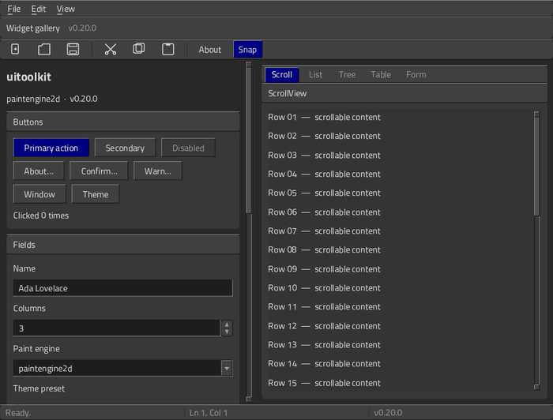

# uitoolkit, running

Every frame on this page was rendered by this repo at **v0.20.0** painting through
**paintengine2d v0.11.0**, on the offscreen backend — no X11, no Wayland, no compositor
involved. Regenerate the stills at any time with:

```sh
go run ./cmd/uitk-shots docs/screenshots
```

The animation was captured by injecting one event at a time into a headless window and
grabbing a frame after each (`app.Window.Inject` + `Capture`); see
[Reproducing the animation](#reproducing-the-animation) at the bottom.

---

## Driven, not posed



114 frames, one per interaction: hovering and clicking a button, opening the File menu
and walking it with the arrow keys, switching the collection tabs, wheel-scrolling the
list, opening a combo popup, and raising a modal dialog. Each step is a real event
through the real run loop.

---

## The gallery

| | |
|---|---|
|  |  |
| **Dark** — buttons, fields, spinner, combo, scroll view | **Light** — same tree, list tab |
|  |  |
| **Menu** — the popup that used to keep focus after dismissal | **Tooltip** — no longer re-appears after Escape |
|  |  |
| **Table** — scrolling now costs what resting costs | **Tree** — flatten cached; mouse move 1.5 ms → 218 ns |
|  |  |
| **Message box** — now traps keyboard focus | **File dialog** — navigates on activation, reports real errors |
|  |  |
| **Combo** | **Accordion** |
|  |  |
| **Scroll** | **Dialog** |

Smaller pieces: [text area](screenshots/gallery-textarea.png) ·
[tool bar](screenshots/gallery-toolbar.png) · [fonts](screenshots/fonts.png)

---

## Applications built with uitoolkit

Two applications grew up in this repository and now live in their own, each
building on uitoolkit's published module. The frames below were rendered by
them; how to run them is in their repositories.

### The mail client — [comms-mail](https://github.com/codemodify/comms-mail)

| | |
|---|---|
|  |  |
| **Dark** — three-pane, threaded, tags and attachments | **Light** — the same store, a different pack |

### The music player — [media-player-music](https://github.com/codemodify/media-player-music)


| | |
|---|---|
|  |  |
| **Marquee** — the cabinet, and folded down | **Lantern** — in its skin, and with it dropped |

It is a visual demo of skins and shaped windows and plays nothing at all —
there is no audio or video dependency anywhere in this toolkit. What the
toolkit gives it is in [players.md](players.md).

---

## Other examples

| | | |
|---|---|---|
|  |  |  |
| `examples/uitoolkit-sample-files` | `examples/uitoolkit-sample-notes` | `examples/uitoolkit-sample-inspector` |

---

## Every widget, one frame each

From `go run ./cmd/uitk-shots`, written to `screenshots/compare/`.

| | | | |
|---|---|---|---|
|  |  |  |  |
| button | checkbox | switch | radio |
|  |  |  |  |
| slider | progress | textfield | textarea |
|  |  |  |  |
| numberfield | combobox | label | panel |
|  |  |  |  |
| listview | tableview | treeview | cardlist |
|  |  |  |  |
| scrollview | splitter | tabview | accordion |
|  |  |  |  |
| menubar | popupmenu | toolbar | statusbar |
|  |  |  |  |
| titlebar | tooltip | messagebox | filedialog |
|  | | | |
| layout | | | |

---

## What the 2026-09-13 review pass bought

| Operation | Before | After | |
|---|---|---|---|
| Repaint after one button invalidates | 6.68 ms | 0.215 ms | 31× |
| Caret blink repaint | 6.90 ms | 0.293 ms | 24× |
| TextArea paint, 8.6 kB of text | 25 ms · 18,360 allocs | 2.2 ms · 0 allocs | 11× |
| TreeView mouse move, 10,200 rows | 1.5 ms · 4 MB | 218 ns · 0 allocs | 6,900× |
| Table frame while scrolling | 219.8 µs · 1,142 allocs | 43.9 µs · 266 allocs | 5× |
| PopupMenu geometry, 200 items | 2.8 ms | 181 µs | 15× |

The repaint numbers come from fixing the engine's damage replay, which let the
full-frame workarounds in `app/window.go` be removed. Benchmarks are in
`app/damage_bench_test.go` and `widgets/rowcache_bench_test.go`:

```sh
go test -run XXX -bench . ./app/ ./widgets/
```

See `RESUME.md` at the repo root for what changed and why.

---

## Running it yourself

Both repos must be on the same revision — `go.mod` resolves the engine from
`../paintengine2d` while the `replace` is in place.

```sh
go run ./examples/uitoolkit-sample-tour         # the tour: a page per capability (docs/tour.md)
go run ./examples/gallery      # widget gallery (the showcase package)
go run ./examples/uitoolkit-sample-notes
go run ./examples/uitoolkit-sample-files
go run ./examples/uitoolkit-sample-skinshape    # a shaped window over a test card
go run ./cmd/uitksettings      # theme browser: 129 packs, preview + gallery
go run ./cmd/uitest-driver     # scripted UI drive, no display needed
go run ./cmd/uitk-shots DIR    # the pictures in the README and these docs
```

The mail client and the music player are not here any more; their
repositories carry their own instructions.

Escape hatches added in the review pass:

- `UITK_PAINT_FULLFRAME=1` — restore the old full-frame repaint, bypassing partial
  redraw. Run the gallery both ways to feel the difference.
- `UITK_PAINT_MSAA=0` — turn off the engine's multisample target.

---

## Reproducing the animation

There is no committed tool for this; it was a throwaway. The shape of it:

```go
a := uitoolkit.New(uitoolkit.Options{Look: style.DarkLook(), Headless: true})
w, _ := a.NewWindow(platform.WindowOptions{Width: 1000, Height: 760, Headless: true})
w.SetContent(showcase.App(a, w, false))

// one event, one pump, one frame
w.Inject(platform.Event{Kind: platform.EventMouseMove, Pos: paintengine2d.Pt(92, 267)})
a.PumpOnce()
w.Capture().WritePNGFile("f0001.png")
```

Then assemble the PNGs into a GIF with whatever you like (ImageMagick, ffmpeg, PIL).
Coordinates were read off `screenshots/gallery-dark.png`, which is 1000×760.
