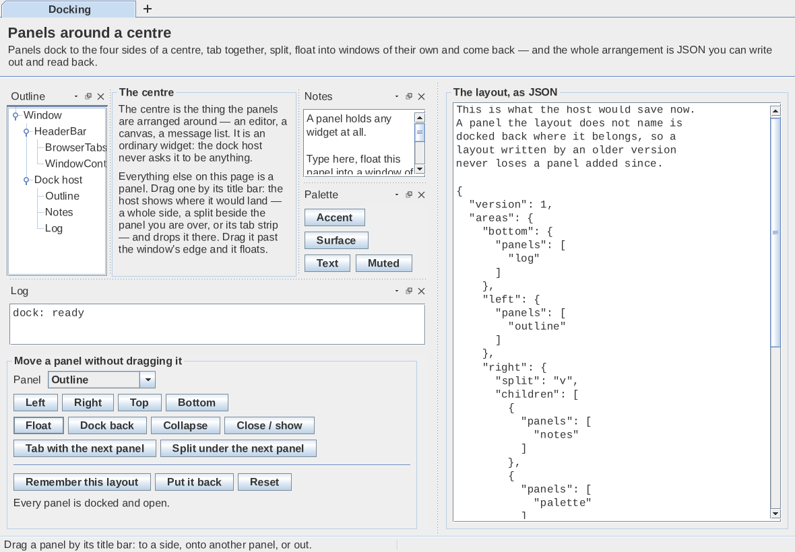
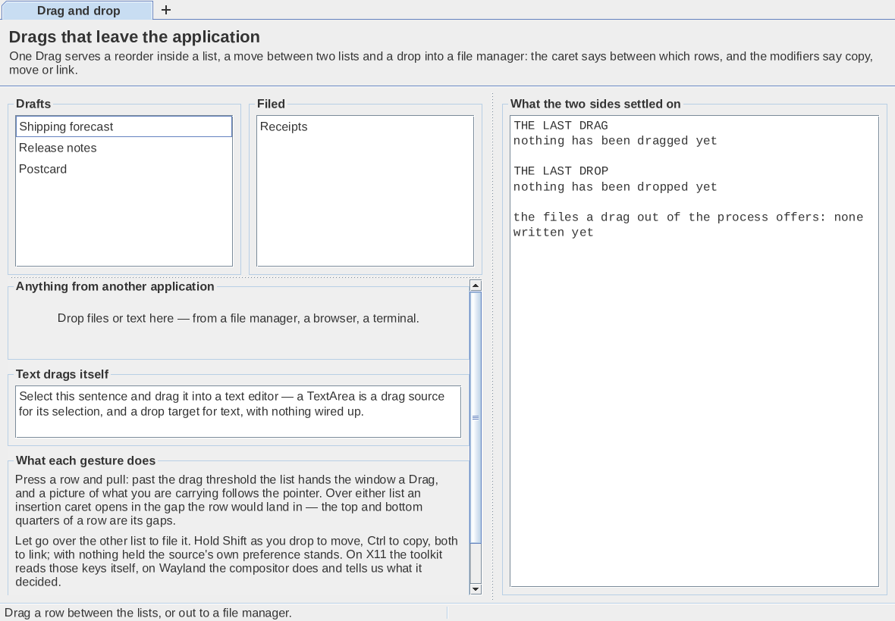
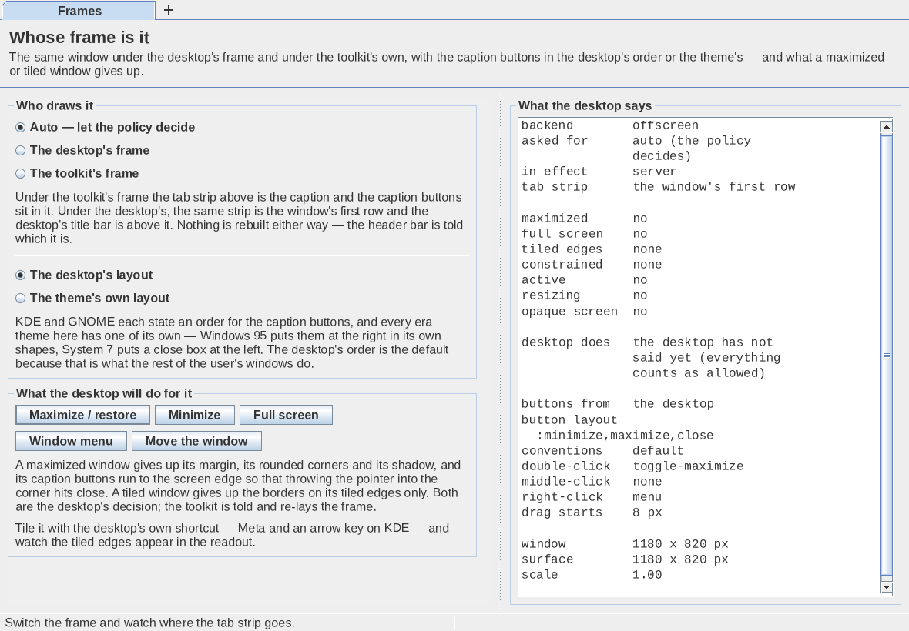
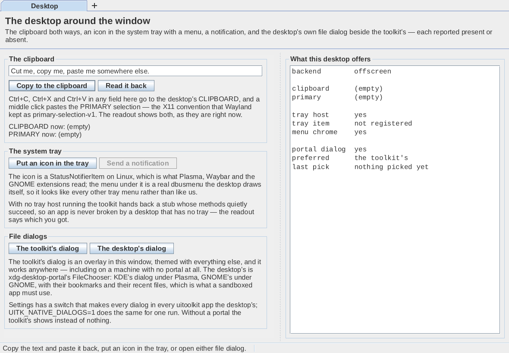
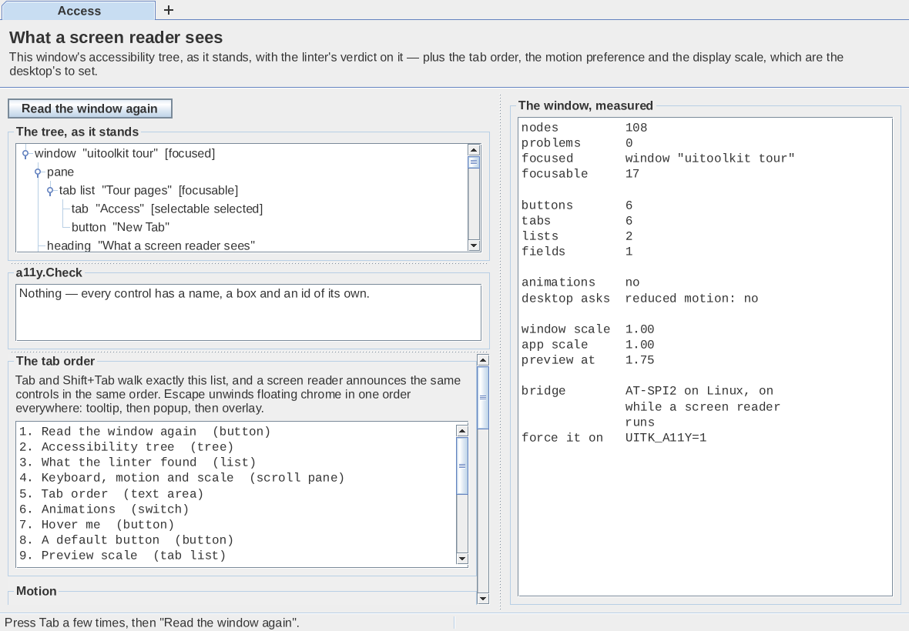
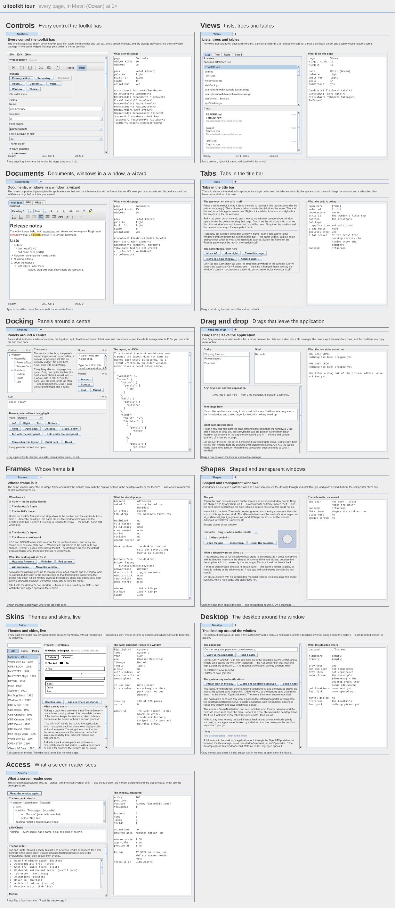

# The tour

The gallery answers "which widgets are there". The tour answers the other
question — **what can a window of this toolkit do** — and it is one app
with a page for each answer, because none of them is a control you can
put on a page of controls.

```bash
go run ./examples/uitoolkit-sample-tour                  # every page, in one window
go run ./examples/uitoolkit-sample-tour -page shapes     # one page (see -page list)
go run ./examples/uitoolkit-sample-tour -page tabs,frames
go run ./examples/uitoolkit-sample-tour -theme win95     # any of the packs, skins included
go run ./examples/uitoolkit-sample-tour -scale 1.75
go run ./examples/uitoolkit-sample-tour -shot out/       # one still per page (PNG)
go run ./examples/uitoolkit-sample-tour -sheet pages.png # every page on one contact sheet
tools/shots/demos.sh                    # docs/screenshots: the stills and the sheet, as WebP
```

Stills are the tour's own 1180 × 820 page at every scale: `-scale 1.75`
draws the same page finer (2065 × 1435 device pixels), not a bigger one.

## The navigation is page one


The tabs along the top are not a tab bar under the caption: they **are**
the window's title bar (`Window.SetTitleBar` with a
[`widgets.BrowserTabs`](decorations.md#tabs-in-the-title-bar)). Drag one
along the strip to reorder it, press × to close it, "+" to open a page
this window does not hold — and pull one down clear of the strip and it
leaves the window, into a second tour running that page, carried under
the pointer by the desktop. Drop it on either window's strip and it joins
that one at the caret; drop it on the desktop and the new window stays;
press Escape and it goes back.

So the thing the user is already holding to move around the app is the
first capability the app is there to show. Every gesture has a button on
the page as well — partly so the page can be driven from the keyboard,
partly because "drag a tab out of the window" is worth being able to try
without committing to a drag.

Where the pack's frame is **merged** (GTK, Windows 10, macOS, the web-era
packs) the caption buttons sit in the strip beside the tabs. Where it is
**stacked** (Windows 95, XP, classic Mac, Motif) the era's own caption
strip stays above and the tabs are the row under it. The page says which
you are looking at, and why.

## What each page proves

| Page | What it demonstrates |
| --- | --- |
| **Tabs** | `BrowserTabs` as a window's caption: reorder, close, "+", tear out into a window of its own and drop back. `widgets.TabMimeType`, `widget.TearOff`. |
| **Docking** | Panels on the four sides of a centre; tabbed together, split, floated into windows of their own, closed, collapsed — and the whole arrangement as JSON, written out and read back on the page. `dock`. |
| **Drag and drop** | One `widget.Drag` serving a reorder, a move between two lists and a real file leaving the process; the insertion caret, copy / move / link, and what the two sides settled on. |
| **Frames** | The desktop's frame against the toolkit's own, caption buttons in the desktop's order or the theme's, and what a maximized, tiled or full-screen window gives up. |
| **Shapes** | A window with a hole in it over a test card, and both windows' press counters side by side: the presses aimed at the hole are counted by the card and not by the ring. Glass where the compositor offers any. |
| **Skins** | Every pack the toolkit has, previewed in a `ThemeScope` and applied to the running application without rebuilding the widget tree — including a skin that gives the window its outline. |
| **Desktop** | The clipboard both ways, a StatusNotifierItem in the tray with a real dbusmenu, a notification, and the desktop's portal file dialog beside the toolkit's — each reported present or absent before it is offered. |
| **Access** | The window's own accessibility tree as a tree view, `a11y.Check`'s verdict on it, the tab order with each control's role, reduced motion, and the same controls drawn at 1 … 2×. |

## The shape of a page

Every page is the same two things: **the thing to try**, and beside it
**what the toolkit says about it** in the mono face. The readout is the
point of the design — most of what these pages demonstrate is invisible
in a screenshot. A drag looks the same whether the target performed a
copy or a move; a hole in a window looks the same whether or not the
press went through it; "the desktop refused to maximize this window" has
no appearance at all. So each page ends in facts:

```
presses: ring  0
presses: card  2 (the ones through the hole)
```

and

```
dropped on   Filed, gap 1
read as      text/uri-list
from         another application
action       move
```

Each page also carries one line under its heading saying what it proves,
and one in the status bar saying what to do.

## The pages

| | |
|---|---|
|  |  |
| **Docking** — four sides, tabs, splits, floats, and the layout as JSON | **Drag and drop** — two lists, a drop zone, and the negotiated action |
|  |  |
| **Frames** — whose frame, which button order, and what maximizing costs | **Shapes** — the silhouette, measured in rects |
|  |  |
| **Skins** — a preview in one pack inside a window running another | **Desktop** — clipboard, tray, notification, both file dialogs |
|  | |
| **Access** — the tree, the linter, the tab order, motion and scale | |

All of them at once:



## Two windows

Every tour window runs in the application's one appearance. A pack
applied, a frame asked for, the caption buttons moved or motion switched
off in one window shows at once in every other's choices and readouts,
"Back to where we started" means where the tour started from whichever
window it is pressed in, and closing a window that is not the last leaves
the look to the ones still open.

Several pages are better with two of them, and the tour makes the second
one the way the app itself teaches: pull a tab out. A drag between the
two lists of two *separate* tour processes is the honest test of the
drag-and-drop page, because then nothing rides along in-process and the
target really does read a `text/uri-list` off the desktop.

```bash
go run ./examples/uitoolkit-sample-tour -page drag &
go run ./examples/uitoolkit-sample-tour -page drag        # drag a row from one to the other
```

## What it needs of the desktop, and what it does without

Every page asks before it offers, and says what it got. On a desktop
without one of these the page stays useful and stops claiming:

| | Where it is missing |
| --- | --- |
| `xdg-toplevel-drag-v1` (KWin ≥ 6, Mutter ≥ 47) | a torn-off tab's window is made at the drop instead of at the press; the Tabs readout says which |
| a compositor that blurs | the shaped window paints its own tint; the Shapes readout says `glass here  no` |
| compositing at all (X11 with no compositor) | the silhouette survives with a hard edge, glass does not; the readout says `opaque screen  yes` |
| a tray host | the toolkit hands back a stub whose methods succeed, and the readout says `tray host  no` |
| `xdg-desktop-portal` | the toolkit's own file dialog opens instead of the desktop's |
| a window position (any Wayland toplevel) | the Shapes page cannot put the shaped window over its card, and says so — X11 clients place their own windows, Wayland ones never learn where they are |

## Tested

Headless, in `examples/uitoolkit-sample-tour/tourapp/tour_test.go`:

- every page builds, lays out and paints in **win95, system7, luna,
  bigsur, tahoe, sourcegit and the `deck` skin**, at 1× and 1.75, and is
  checked for having drawn anything at all;
- every page, and the whole tour in one window with every page visited,
  is clean under `a11y.Check`;
- **Tab** reaches every control on every page, and every control it stops
  on describes itself;
- the tab strip reorders, keeps a window's last page, tears a page out
  into a window of its own and takes one back at the caret;
- a dock panel floats, docks back, tabs with another, and the arrangement
  survives a JSON round trip; a panel docked back by a drag updates the
  page's note as the buttons do;
- two tour windows share one appearance: a pack, the frame, the caption
  buttons and motion changed in one show in the other;
- "+"'s menu drops from the "+";
- `-shot` is 1180 × 820 device pixels at 1× and 2065 × 1435 at 1.75, and
  `-sheet` puts the pages side by side at half size
  (`examples/uitoolkit-sample-tour/main_test.go`);
- a row dragged between the two lists lands at the caret and is moved or
  copied according to the action the target reported;
- every silhouette the Shapes page offers rasterises to a region with the
  hole where the page says it is.

On real hardware, in the nested-KWin rig (`tools/e2e`), on **Wayland and
X11**: see [docs/e2e/2026-09-21/tour-realhw.md](e2e/2026-09-21/tour-realhw.md).
Every page again on both backends after the polish pass (instance 27),
with a page torn into a window of its own and the caption-button choice
made there showing in the first window at once.
